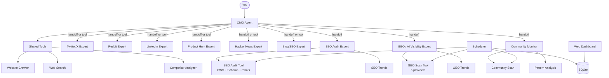

<div align="center">
  
</div>

<h1 align="center">OpenCMO</h1>

<div align="center">
  <strong>The open-source AI CMO that does what $99/month tools do — for free.</strong>
</div>
<br/>

<div align="center">
  <a href="README.md">🇺🇸 English</a> | <a href="README_zh.md">🇨🇳 中文</a> | <a href="README_ja.md">🇯🇵 日本語</a> | <a href="README_ko.md">🇰🇷 한국어</a> | <a href="README_es.md">🇪🇸 Español</a>
</div>

<div align="center">
  <a href="https://www.python.org/downloads/"></a>
  <a href="LICENSE"></a>
  <a href="https://github.com/study8677/OpenCMO/stargazers"></a>
</div>

---

> **Okara charges $99/month. We charge $0.** And we cover more platforms.

## What is OpenCMO?

OpenCMO is a multi-agent AI system that acts as your full marketing team. Give it a URL — it crawls your site, extracts selling points, and generates ready-to-post content for **9 channels** through a simple CLI.

Built for **indie developers and small teams** who'd rather ship than write marketing copy.

## Why OpenCMO over paid alternatives?

| Capability | Okara ($99/mo) | OpenCMO (Free) |
|---|:---:|:---:|
| Twitter/X content | Yes | Yes |
| Reddit posts | Generate only | Generate + Monitor |
| LinkedIn posts | Planned | Yes |
| Product Hunt launch copy | No | Yes |
| Hacker News posts | Monitor only | Generate + Monitor |
| Blog/SEO articles | No | Yes |
| Web search (trends/competitors) | Yes | Yes |
| SEO audit (CWV + Schema.org + robots/sitemap) | Basic | Yes |
| GEO score (5 AI platforms) | Yes | Yes |
| Community monitoring + pattern analysis | Yes | Yes |
| Competitor analysis | Yes | Yes |
| Continuous monitoring (scheduler) | Yes | Yes |
| Web dashboard with trend charts | Yes | Yes |
| Configurable models per agent | No | Yes |
| Multi-channel in one command | No | Yes |
| Open source | No | Yes |
| **Platforms covered** | **3** | **9** |

## Features

### 9 Platform Experts
- **Twitter/X** — Tweet variants & threads with scroll-stopping hooks
- **Reddit** — Authentic, story-driven posts for r/SideProject and niche subs
- **LinkedIn** — Professional, data-driven posts without corporate jargon
- **Product Hunt** — Taglines, descriptions, and Maker's first comment
- **Hacker News** — Understated, technically-focused Show HN posts
- **Blog/SEO** — SEO-friendly article outlines for Medium and Dev.to

### Marketing Intelligence
- **SEO Audit** — Core Web Vitals (LCP/CLS/TBT via Google PageSpeed), Schema.org/JSON-LD detection, robots.txt/sitemap.xml checks, on-page analysis — each issue with copy-pasteable fix
- **GEO Score** — AI search visibility across 5 platforms: Perplexity, You.com (crawl-based), ChatGPT, Claude, Gemini (API-based, opt-in)
- **Competitor Analysis** — Structured intelligence: features, pricing, positioning, differentiation
- **Community Monitor** — Scan Reddit + HN + Dev.to, track discussions over time, analyze engagement patterns, draft authentic replies
- **Web Search** — Real-time competitive research, market trends, keyword discovery

### Continuous Monitoring
- **Scheduler** — Cron-based automated scans (SEO/GEO/Community) via `/monitor` CLI commands
- **Trend Analysis** — Historical SEO & GEO score trends from persistent SQLite storage
- **Community Patterns** — Engagement velocity, platform distribution, discussion tracking

### Web Dashboard
- **FastAPI + Chart.js** — Project overview, SEO/GEO/Community trend charts
- **No frontend build** — Server-rendered HTML, Chart.js from CDN
- **Start with one command** — `opencmo-web` or `/web` in CLI

### Smart Orchestration
- **Single platform** → handoff to expert for deep, interactive content creation
- **Multi-channel** → CMO calls all experts as tools, synthesizes a unified marketing plan
- **Configurable models** — Set `OPENCMO_MODEL_DEFAULT=gpt-4o-mini` or per-agent overrides
- **Context-aware** — Maintains conversation history with automatic truncation

## Architecture



## Quick Start

### 1. Install

```bash
pip install -e .
crawl4ai-setup

# Optional: install extras
pip install -e ".[all]"   # scheduler + web dashboard + GEO premium
```

### 2. Configure

```bash
cp .env.example .env
# Add your OpenAI API key (required)
# Optional: ANTHROPIC_API_KEY, GOOGLE_AI_API_KEY, PAGESPEED_API_KEY
```

### 3. Run

```bash
opencmo                   # Interactive CLI
opencmo-web               # Web dashboard (localhost:8080)
```

### CLI Commands

```
/monitor add <brand> <url> <category>   # Add continuous monitoring
/monitor list                            # List all monitors
/monitor run <id>                        # Run a scan immediately
/status                                  # Show all project scan statuses
/web                                     # Start web dashboard
```

## Example Sessions

```text
You: Help me create a full marketing plan for https://crawl4ai.com/

[CMO Agent]
Here's your complete multi-platform marketing plan for Crawl4AI:
## Twitter/X  ## Reddit  ## LinkedIn  ## Product Hunt  ## Hacker News  ## Blog
...
```

```text
You: Audit the SEO of https://myproduct.com

[SEO Audit Expert]
# SEO Audit Report
[OK] Performance Score: 87/100
[WARNING] LCP: 2800ms (Good <2500ms)
[OK] Schema.org: Found types: Organization, WebSite
[CRITICAL] sitemap.xml: Not found
...
```

```text
You: What's our GEO score for "web scraping"?

[AI Visibility Expert]
# GEO Score: 62/100
## Platform Results (2 enabled, 3 disabled)
### Perplexity [enabled]: FOUND — 3 mentions
### You.com [enabled]: FOUND — 1 mention
## Disabled Platforms
- ChatGPT: set OPENCMO_GEO_CHATGPT=1 to enable
...
```

```text
You: /monitor add Crawl4AI https://crawl4ai.com "web scraping"

Monitor #1 created: Crawl4AI (https://crawl4ai.com) — full scan, cron: 0 9 * * *
```

## Roadmap

- [x] 9 platform experts with multi-channel orchestration
- [x] SEO audit with CWV, Schema.org, robots/sitemap
- [x] GEO score across 5 AI platforms
- [x] Community monitoring with pattern analysis
- [x] Competitor analysis
- [x] Persistent SQLite storage
- [x] Configurable models per agent
- [x] Scheduler for continuous monitoring
- [x] Web dashboard with trend charts
- [ ] Auto-publish via platform APIs
- [ ] Full-site SEO crawl (sitemap-based)
- [ ] Custom brand voice training

## Contributing

Contributions welcome! Fork, branch, PR.

**Ideas:**
- New platform experts (YouTube, Instagram, TikTok)
- Better prompts for existing agents
- Web dashboard enhancements
- Auto-publish integrations

## License

Apache License 2.0 — see [LICENSE](LICENSE).

---

<div align="center">
  If OpenCMO saves you time, a <strong>Star</strong> would mean a lot!
</div>
