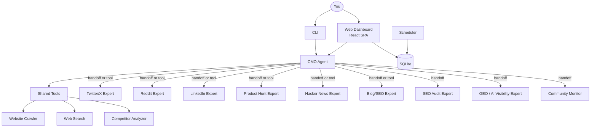
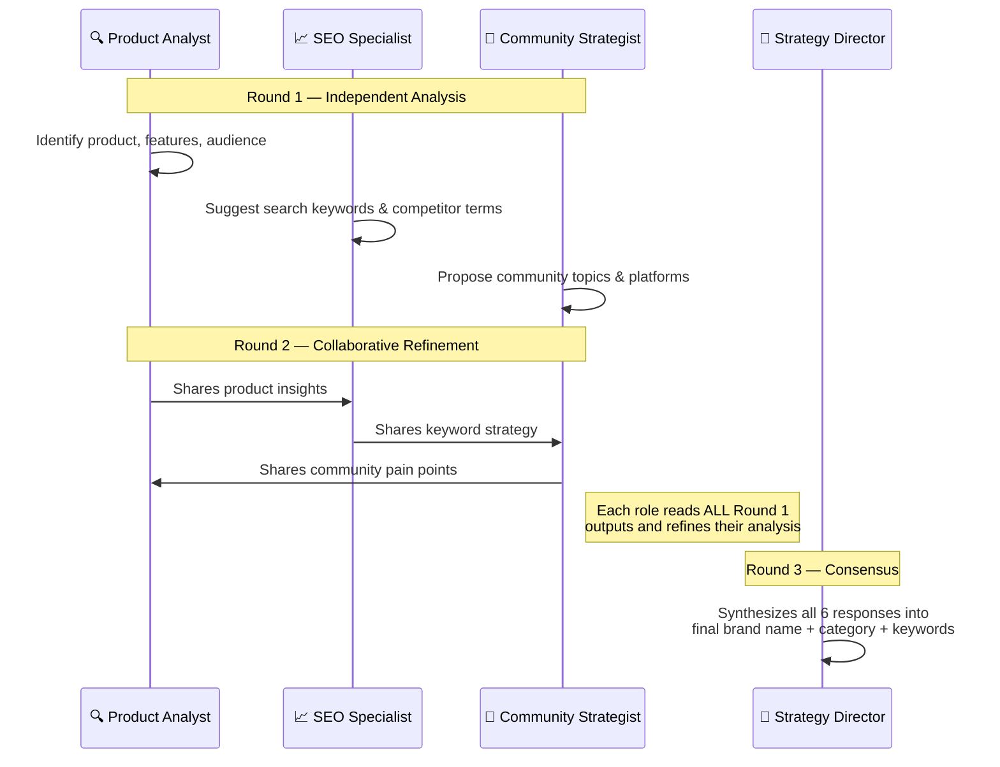

<div align="center">
  
</div>

<h1 align="center">OpenCMO</h1>

<p align="center">
  <strong>Open-source AI CMO — your full marketing team in one tool.</strong><br/>
  <sub>Multi-agent system with 10 expert agents, real-time monitoring, and a modern web dashboard.</sub>
</p>

<div align="center">
  <a href="README.md">🇺🇸 English</a> | <a href="README_zh.md">🇨🇳 中文</a> | <a href="README_ja.md">🇯🇵 日本語</a> | <a href="README_ko.md">🇰🇷 한국어</a> | <a href="README_es.md">🇪🇸 Español</a>
</div>

<div align="center">
  <a href="https://www.python.org/downloads/"></a>
  <a href="LICENSE"></a>
  <a href="https://github.com/study8677/OpenCMO/stargazers"></a>
</div>

---

## 🖼️ Gallery & Interface

Explore the beautiful, dark-themed React SPA dashboard designed for a modern multi-agent marketing workflow.

<details open>
<summary><b>View Runtime Screenshots</b></summary>
<br>

<div align="center">
  
  <br/><sub><b>Main Dashboard</b>: Real-time project tracking across SEO, GEO AI visibility, and Community metrics.</sub>
</div>
<br/>

<div align="center">
  
  <br/><sub><b>Expert Chat Interface</b>: Chat with 10 AI marketing experts. Pick a specific agent or let the CMO auto-route your query.</sub>
</div>
<br/>

<div align="center">
  
  <br/><sub><b>Monitors & Multi-Agent Analysis</b>: Watch 3 AI roles debate your strategy in real-time to extract the best keywords.</sub>
</div>
<br/>

<div align="center">
  
  <br/><sub><b>Multi-Agent Discussion</b>: See the AI roles debating the product strategy in an interactive dialog modal.</sub>
</div>
<br/>

<div align="center">
  
  <br/><sub><b>Settings</b>: Easily configure your API provider (OpenAI, DeepSeek, Ollama, etc.) safely in the UI.</sub>
</div>

</details>

---

## What is OpenCMO?

OpenCMO is a **multi-agent AI marketing system** for indie developers and small teams. Enter a URL — the system crawls your site, runs a multi-agent strategy discussion, and automatically sets up monitoring for SEO, AI visibility, and community discussions.

### Key Capabilities

- **10 AI Expert Agents** — Twitter/X, Reddit, LinkedIn, Product Hunt, Hacker News, Blog/SEO, SEO Audit, GEO (AI Visibility), Community Monitor, and the CMO orchestrator
- **Smart URL Analysis** — Paste any URL; 3 AI roles (Product Analyst, SEO Specialist, Community Strategist) debate 3 rounds to extract brand name, category, and monitoring keywords
- **Knowledge Graph** — Interactive force-directed graph visualizing relationships between your brand, keywords, competitors, community discussions, and SERP rankings
- **Real-time Web Dashboard** — React SPA with dark sidebar, project cards, trend charts, i18n (EN/中文)
- **Chat with Experts** — ChatGPT-style interface with conversation history; pick a specific agent or let CMO auto-route
- **Continuous Monitoring** — Cron-based scheduled scans for SEO, GEO, and community metrics
- **Any LLM Provider** — OpenAI, NVIDIA NIM, DeepSeek, Ollama, or any OpenAI-compatible API

## Architecture



## 🚀 Quick Start

### 1. Install

```bash
git clone https://github.com/study8677/OpenCMO.git
cd OpenCMO

# Install requirements via pip
pip install -e ".[all]"

# Initialize crawler dependencies
crawl4ai-setup
```

### 2. Configure

```bash
cp .env.example .env

# Edit .env and supply your API key:
# OPENAI_API_KEY=sk-... 
```
*(Supports OpenAI, DeepSeek, NIM, Ollama, etc. See `.env.example`)*

### 3. Run the Application

Start the modern web dashboard to access the UI:

```bash
opencmo-web
```
🚀 **Open [http://localhost:8080/app](http://localhost:8080/app) in your web browser.**

<details>
<summary><b>CLI Mode (Optional)</b></summary>

Alternatively, run the interactive terminal interface:
```bash
opencmo
```
</details>

### 4. How to Use

1. Go to **Monitors** → paste a URL → click **Start Monitoring**
2. Watch the AI multi-agent discussion analyze your product in real-time
3. System auto-extracts brand name, category, and keywords
4. Full scan runs automatically (SEO + GEO + Community)
5. View results in **Dashboard** → click your project

## Features

### 🤖 10 AI Expert Agents

| Agent | What it does |
|-------|-------------|
| **CMO Agent** | Orchestrates everything, auto-routes to the right expert |
| **Twitter/X** | Tweets, threads & engagement hooks |
| **Reddit** | Authentic story-driven posts + smart reply to existing discussions |
| **LinkedIn** | Professional thought-leadership posts |
| **Product Hunt** | Launch taglines, descriptions & maker comments |
| **Hacker News** | Technical Show HN posts |
| **Blog/SEO** | SEO-optimized articles (2000+ words) |
| **SEO Audit** | Core Web Vitals, Schema.org, robots/sitemap analysis |
| **GEO (AI Visibility)** | Brand mentions across Perplexity, You.com, ChatGPT, Claude, Gemini |
| **Community Monitor** | Scans Reddit, HN, Dev.to for discussions |

### 🔗 Reddit Integration (New)

- **Smart Discovery** — Scans Reddit for high-relevance posts matching your product category
- **AI-Powered Replies** — Generates authentic, non-promotional replies tailored to each discussion
- **Human-in-the-Loop** — Preview AI-drafted replies before publishing; edit and confirm via the UI
- **Credential Management** — Configure Reddit API keys directly from the Settings dialog
- **Auto-Publish Toggle** — Enable/disable automatic posting with a single switch

### 📊 Monitoring & Analytics

- **SEO** — Performance score, LCP/CLS/TBT, Schema.org detection, robots.txt & sitemap checks
- **GEO** — AI search visibility score (0-100) across 5 platforms
- **SERP** — Keyword ranking tracking on Google
- **Community** — Discussion counts, engagement scores, platform distribution
- **Knowledge Graph** — Force-directed graph connecting all data dimensions

### 🕸️ Knowledge Graph (New)

- **Interactive Force Graph** — Drag, zoom, and explore the relationships between your brand, keywords, discussions, SERP rankings, and competitors in a dynamic force-directed visualization
- **Real-time Updates** — Graph auto-refreshes every 30 seconds as new scan data arrives
- **6 Node Types** — Brand (purple), Keywords (cyan), Discussions (amber), SERP Rankings (green), Competitors (red), Competitor Keywords (orange)
- **Keyword Overlap Detection** — Automatically highlights keywords shared between your brand and competitors with red dashed lines
- **Competitor Management** — Add competitors with their URLs and keywords; the graph instantly updates to show competitive relationships
- **Hover Details** — Hover over any node to see detailed info (engagement scores, rankings, platform, etc.)

### 🎯 Smart URL Analysis (Multi-Agent Discussion)

When you add a URL, **3 AI roles hold a real 3-round collaborative discussion** — they don't just analyze independently, they actually read and build on each other's insights:



| Round | What happens |
|-------|-------------|
| **Round 1** | Each role gives **independent** initial analysis — product positioning, SEO keywords, community topics |
| **Round 2** | Each role **reads all Round 1 outputs**, then refines their suggestions based on colleagues' insights. The Product Analyst's feature discovery inspires the SEO Specialist to find more precise keywords, which in turn helps the Community Strategist identify better discussion topics |
| **Round 3** | A **Strategy Director** reads the full 6-message discussion and synthesizes the final consensus: brand name + category + 5-8 monitoring keywords |

> **Why this matters**: A single-pass LLM call would miss cross-domain connections. The multi-round discussion produces significantly better keywords because each specialist's domain knowledge enriches the others — just like a real marketing team brainstorming session.

### 🌐 Web Dashboard

- Dark sidebar, modern card layout
- i18n support (English / 中文)
- Chat with conversation history (SQLite-persisted)
- Agent selection grid — click to chat with any expert
- Settings dialog for API key configuration
- Real-time analysis progress dialog

### 🔧 Flexible Configuration

```bash
# OpenAI (default)
OPENAI_API_KEY=sk-...

# NVIDIA NIM
OPENAI_API_KEY=nvapi-...
OPENAI_BASE_URL=https://integrate.api.nvidia.com/v1
OPENCMO_MODEL_DEFAULT=moonshotai/kimi-k2.5

# DeepSeek
OPENAI_API_KEY=sk-...
OPENAI_BASE_URL=https://api.deepseek.com/v1
OPENCMO_MODEL_DEFAULT=deepseek-chat

# Local Ollama
OPENAI_API_KEY=ollama
OPENAI_BASE_URL=http://localhost:11434/v1
OPENCMO_MODEL_DEFAULT=llama3
```

## CLI Commands

```
opencmo                                    # Interactive chat
opencmo-web                                # Web dashboard

/monitor add <brand> <url> <category>      # Add monitoring
/monitor list                              # List monitors
/monitor run <id>                          # Run scan now
/status                                    # All project statuses
/web                                       # Start web server
```

## Roadmap

- [x] 10 expert agents with multi-channel orchestration
- [x] Multi-agent URL analysis (3 roles × 3 rounds)
- [x] React SPA dashboard with dark theme
- [x] Chat with agent selection & conversation history
- [x] SEO audit, GEO score, SERP tracking, community monitoring
- [x] i18n (English / 中文)
- [x] Settings UI for API key management
- [x] Multi-provider support (OpenAI, NVIDIA, DeepSeek, Ollama)
- [x] Reddit smart reply & community engagement
- [x] Reddit credential management in Settings UI
- [x] Knowledge Graph — interactive force-directed visualization of brand marketing ecosystem
- [x] Competitor tracking & keyword overlap analysis
- [ ] Auto-publish to more platforms (Twitter, LinkedIn)
- [ ] Full-site SEO crawl
- [ ] Custom brand voice training

## Contributing

Contributions welcome! Fork, branch, PR.

## License

Apache License 2.0 — see [LICENSE](LICENSE).

---

<div align="center">
  <sub>If OpenCMO helps you, a ⭐ would mean a lot!</sub>
</div>
