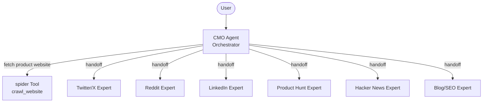

<div align="center">
  
</div>

<h1 align="center">OpenCMO</h1>

<div align="center">
  <strong>Your AI Chief Marketing Officer — built for indie developers who'd rather ship than market.</strong>
</div>
<br/>

<div align="center">
  🇺🇸 English | <a href="README_zh.md">🇨🇳 中文</a> | <a href="README_ja.md">🇯🇵 日本語</a> | <a href="README_ko.md">🇰🇷 한국어</a> | <a href="README_es.md">🇪🇸 Español</a>
</div>

<div align="center">
  <a href="https://www.python.org/downloads/"></a>
  <a href="LICENSE"></a>
  <a href="https://github.com/your-username/OpenCMO/stargazers"></a>
</div>

---

## 🌟 What is OpenCMO?

OpenCMO is an open-source multi-agent system that acts as your **AI marketing team**. Give it your product URL, and it will crawl your site, extract key selling points, and generate platform-specific marketing content — all through a simple, elegant CLI.

Built specifically for **indie developers, solo founders, and small teams** who have a great product but lack the time (or desire) to write marketing copy for every channel.

## ✨ Features

- **🐦 Twitter/X Expert** — Generates tweet variants & threads with scroll-stopping hooks.
- **🤖 Reddit Expert** — Crafts authentic, story-driven posts tailored for r/SideProject and niche communities.
- **💼 LinkedIn Expert** — Writes professional, data-driven posts that skip the corporate jargon.
- **🚀 Product Hunt Expert** — Creates catchy taglines, descriptions, and the all-important Maker's first comment.
- **📰 Hacker News Expert** — Produces understated, technically-focused "Show HN" posts.
- **📝 Blog/SEO Expert** — Outlines SEO-friendly articles optimized for Medium and Dev.to.

## 🏗️ Architecture



The **CMO Agent** crawls your website, extracts a one-liner, core selling points, and target audience profile. It then intelligently delegates to the right platform expert based on your specific request.

## 🚀 Quick Start

### 1. Install

```bash
pip install -e .
crawl4ai-setup
```

### 2. Configure

```bash
cp .env.example .env
# Edit .env and add your OpenAI API key
```

### 3. Run

```bash
opencmo
```

## 💻 Example Session

```text
============================================================
  🎯 OpenCMO - Your AI Chief Marketing Officer
  Type a product URL and what you need, or 'quit' to exit.
============================================================

You: Help me write a tweet for https://crawl4ai.com/

CMO is working... ⚙️

[Twitter/X Expert] 🐦
Here are 3 tweet variants for Crawl4AI:

1. "Tired of writing web scrapers from scratch?
   Crawl4AI gives you LLM-ready markdown from any URL in one line of Python.
   Open source. Blazing fast. #OpenSource #AI"

2. ...

You: Make it more casual and fun

CMO is working... ⚙️

[Twitter/X Expert] 🐦
Sure! Here's a more casual take:
...

You: Now write me a Product Hunt launch post

CMO is working... ⚙️

[Product Hunt Expert] 🚀
...

You: quit
Goodbye! 👋
```

## 🗺️ Roadmap

- [ ] 🌐 Web UI with real-time streaming
- [ ] ⚡ Full-channel mode: generate content for all 6 platforms in one command
- [ ] 🔗 Auto-publish to platforms via API integrations
- [ ] 📅 Content calendar and scheduling
- [ ] 🧪 A/B testing suggestions
- [ ] 🎬 More platform experts (YouTube, Instagram, TikTok, etc.)
- [ ] 🎭 Custom brand voice training

## 🤝 Contributing

Contributions are always welcome! Here's how you can help:

1. **Fork** the repository
2. **Create** a feature branch (`git checkout -b feature/amazing-feature`)
3. **Commit** your changes (`git commit -m 'Add amazing feature'`)
4. **Push** to the branch (`git push origin feature/amazing-feature`)
5. **Open** a Pull Request

**Ideas for contributions:**
- New platform expert agents
- Improved prompts for existing agents
- Web UI frontend
- Tests and documentation

## 📄 License

This project is licensed under the Apache License 2.0 — see the [LICENSE](LICENSE) file for details.

---

<div align="center">
  If OpenCMO helps you, giving it a <strong>Star ⭐</strong> would mean the world to us!
</div>
