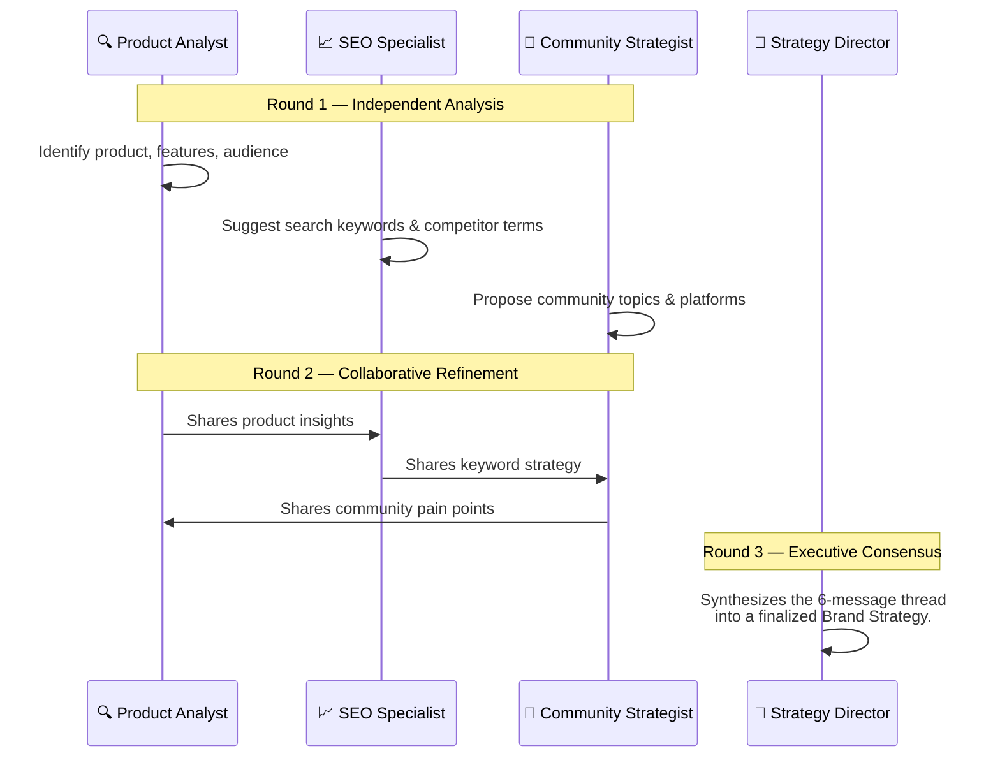

<div align="center">
  
</div>

<h1 align="center">🚀 OpenCMO</h1>

<p align="center">
  <strong>The Open-Source AI Chief Marketing Officer — Your Full Marketing Team in One Tool.</strong><br/>
  <sub>A powerful multi-agent system featuring 10 elite AI experts, real-time strategy monitoring, and a stunning modern web dashboard.</sub>
</p>

<div align="center">
  <a href="README.md">🇺🇸 English</a> | <a href="README_zh.md">🇨🇳 中文</a> | <a href="README_ja.md">🇯🇵 日本語</a> | <a href="README_ko.md">🇰🇷 한국어</a> | <a href="README_es.md">🇪🇸 Español</a>
</div>

<p align="center">
  <a href="https://www.python.org/downloads/"></a>
  <a href="LICENSE"></a>
  <a href="https://github.com/study8677/OpenCMO/stargazers"></a>
  
</p>

---

## 🌟 What is OpenCMO?

OpenCMO is a **multi-agent AI marketing ecosystem** tailored for indie hackers, startups, and small teams. Simply provide your product's URL, and OpenCMO will:
1. **Analyze your website** deeply to understand your product and audience.
2. **Orchestrate a multi-agent strategy debate** to pinpoint the best keywords, positioning, and target communities.
3. **Automate continuous monitoring** across SEO, AI search visibility (GEO), and developer communities (Reddit, Hacker News, Dev.to).

---

## ✨ Interface & Experience

Our system comes beautifully packaged in a dark-themed, glassmorphic React Single Page Application (SPA), designed for maximum clarity and control. 

<div align="center">
  
  <p><i>Real-time Project Dashboard — Track your SEO, GEO (AI Visibility), and Community Engagement at a glance.</i></p>
</div>

---

## 🕸️ Interactive Knowledge Graph

The **Knowledge Graph** is the beating heart of your market intelligence. We transform abstract data into an interactive, visually stunning force-directed network diagram.

<div align="center">
  
  <p><i>A dynamic, 3D force-directed map of your entire marketing ecosystem.</i></p>
</div>

### Why it's a Game-Changer:
- 🔵 **Interactive Exploration**: Zoom, drag, and pan across your brand's digital unvierse. 
- 🟢 **6 Node Dimensions**: Visually distinguish your Brand (Purple), Keywords (Cyan), Community Discussions (Amber), SERP Rankings (Green), Competitors (Red), and Overlapping Keywords (Orange).
- 🔴 **Competitor Intel**: Add competitor URLs to instantly visualize shared battlegrounds—marked by glowing, red dashed connection lines.
- ⚡ **Real-Time Sync**: Graph automatically re-balances every 30 seconds as new insights are scraped.

---

## 👥 Meet Your AI Marketing Team

OpenCMO ships with **10 specialized AI agents** that work together cohesively.

| Agent Role | Specialty | Core Responsibility |
| :--- | :--- | :--- |
| **👔 CMO Agent** | Orchestration | The brain of the operation. Routes tasks to the perfect expert automatically. |
| **🐦 Twitter/X Xpert** | Micro-blogging | Crafts engaging tweets, hooks, and viral threads. |
| **👽 Reddit Strategist**| Community Building | Drafts authentic, anti-promotional posts and smart replies to live subreddits. |
| **💼 LinkedIn Pro** | B2B Networking | Forms highly professional, thought-leadership posts. |
| **🚀 Product Hunt** | Launch Tactics | Prepares impactful taglines, descriptions, and maker comments. |
| **💻 Hacker News** | Tech Crowd | Formats highly technical "Show HN" posts and handles critical feedback. |
| **📝 Blog/SEO Writer**| Long-form Content | Writes deeply comprehensive, SEO-optimized articles (2000+ words). |
| **🔍 SEO Auditor** | Technical SEO | Audits Core Web Vitals, Schema.org, robots.txt, and sitemaps. |
| **🤖 GEO Specialist** | Generative Engine | Monitors your brand presence across Perplexity, ChatGPT, Claude, and Gemini. |
| **👀 Community Radar** | Social Listening | Scours Reddit, HN, and Dev.to and alerts you to relevant discussions. |

---

## 🧩 How It Works: Multi-Agent Debate

When you submit a URL, OpenCMO doesn't just run a single LLM prompt. It hosts a **3-round collaborative discussion** among specialized agents.



By allowing agents to read and react to each other, OpenCMO produces strategies that are fundamentally richer, avoiding the tunnel-vision of single-pass AI responses.

---

## ⚙️ Quick Start Guide

OpenCMO supports any OpenAI-compatible API, giving you total freedom over your LLM backend (**OpenAI, DeepSeek, NVIDIA NIM, Ollama**, etc.).

### 1. Installation

```bash
git clone https://github.com/study8677/OpenCMO.git
cd OpenCMO

# Install all Python dependencies
pip install -e ".[all]"

# Initialize crawler playbooks
crawl4ai-setup
```

### 2. Configuration

```bash
cp .env.example .env
```
Edit `.env` to include your provider. *Example for OpenAI:*
```env
OPENAI_API_KEY=sk-yourAPIKeyHere
OPENCMO_MODEL_DEFAULT=gpt-4o
```

### 3. Launch the Dashboard

```bash
opencmo-web
```
🚀 **Boom! Your CMO is live.** Open [http://localhost:8080/app](http://localhost:8080/app) in your browser.

> *Prefer the terminal? Run `opencmo` for an interactive CLI chatbot mode.*

---

## 📸 More Interface Previews

<details>
<summary><b>Click to expand our beautiful UI gallery</b></summary>
<br>

**1. Multi-Agent Discussion Modal**  


**2. Chat Interface with Experts**  


**3. Monitors & Analysis Panel**  


**4. Settings & Safe Key Storage**  


</details>

---

## 🗺️ Roadmap & Features

- [x] **10 AI Marketing Experts** with chat and routing.
- [x] **Intelligent URL Analysis** via agent debate.
- [x] **Dark-themed React SPA** with multi-language (EN/ZH) support.
- [x] **API Agnostic** (OpenAI, Anthropic, DeepSeek, Local Ollama).
- [x] **Interactive Knowledge Graph** for visual strategy mapping.
- [x] **Smart Reddit Integration** (Thread discovery & AI replies).
- [ ] Automated Cross-Platform Publishing (Twitter, LinkedIn).
- [ ] Enterprise-grade full-site SEO crawls.
- [ ] Custom Brand Voice fine-tuning.

---

<p align="center">
  Made with ❤️ by the Open Source Community. <br/>
  <b>If OpenCMO saves you time, please give it a ⭐ on GitHub!</b>
</p>
