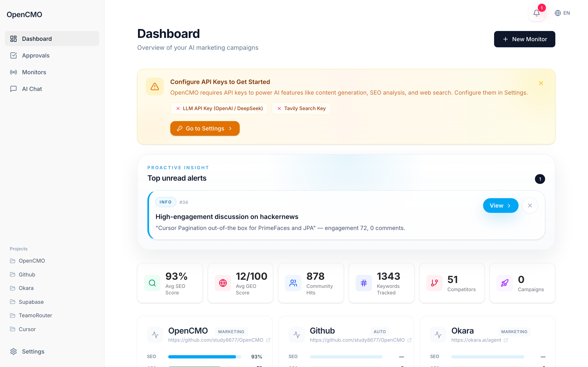
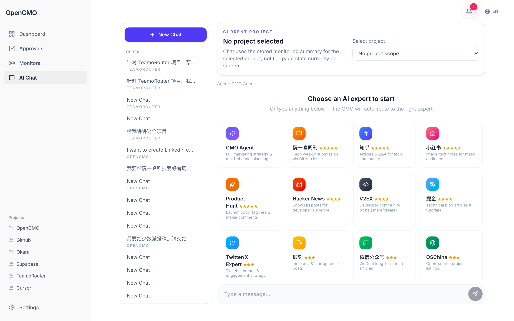
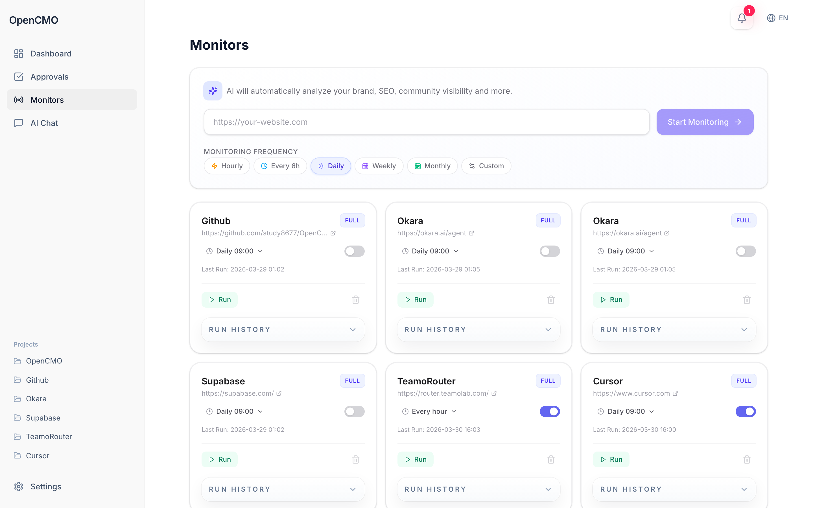
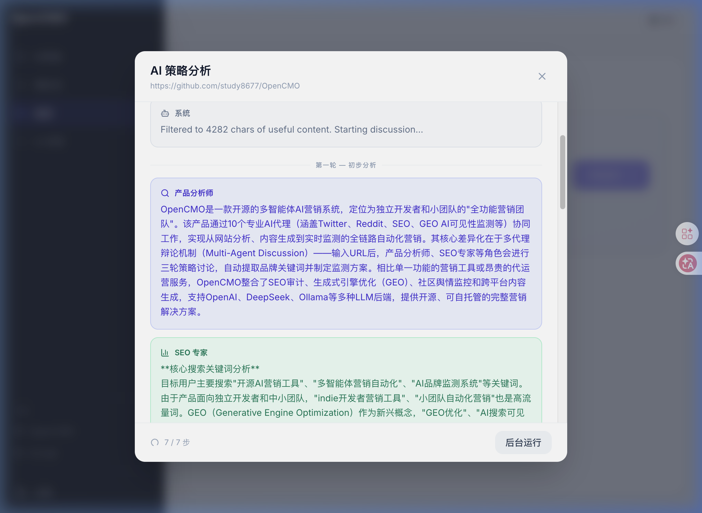
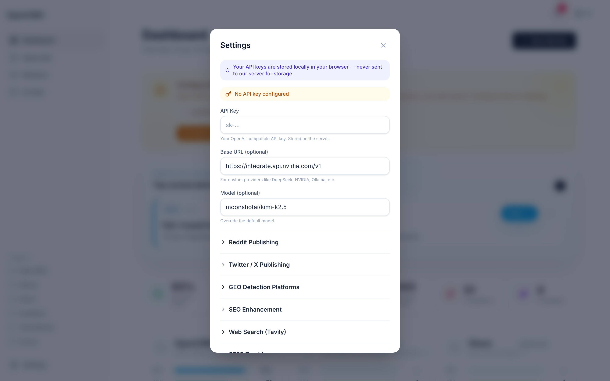

<div align="center">
  
</div>

<h1 align="center">OpenCMO</h1>

<p align="center">
  <strong>CMO de IA Open Source — tu equipo de marketing completo en una sola herramienta.</strong><br/>
  <sub>Sistema multi-agente con 10 expertos IA, monitoreo en tiempo real y dashboard web moderno.</sub>
</p>

<div align="center">
  <a href="README.md">🇺🇸 English</a> | <a href="README_zh.md">🇨🇳 中文</a> | <a href="README_ja.md">🇯🇵 日本語</a> | <a href="README_ko.md">🇰🇷 한국어</a> | <a href="README_es.md">🇪🇸 Español</a>
</div>

<div align="center">
  <a href="https://www.python.org/downloads/"></a>
  <a href="LICENSE"></a>
  <a href="https://github.com/study8677/OpenCMO/stargazers"></a>
</div>

---

## 🖼️ Galería e Interfaz

Explora el hermoso panel React SPA con tema oscuro, diseñado para un moderno flujo de marketing multi-agente.

<details open>
<summary><b>Ver Capturas de Pantalla</b></summary>
<br>

<div align="center">
  
  <br/><sub><b>Dashboard Principal</b>: Seguimiento de proyectos en tiempo real a través de SEO, GEO visibilidad IA y métricas de Comunidad.</sub>
</div>
<br/>

<div align="center">
  
  <br/><sub><b>Interfaz de Chat Experto</b>: Chatea con 10 expertos en marketing de IA. Elige un agente específico o deja que el CMO enrute tu consulta.</sub>
</div>
<br/>

<div align="center">
  
  <br/><sub><b>Monitores y Análisis Multi-Agente</b>: Observa cómo 3 roles de IA debaten tu estrategia en tiempo real para extraer las mejores palabras clave.</sub>
</div>
<br/>

<div align="center">
  
  <br/><sub><b>Discusión Multi-Agente</b>: Mira a los roles de IA debatiendo la estrategia del producto en un panel de diálogo interactivo.</sub>
</div>
<br/>

<div align="center">
  
  <br/><sub><b>Configuración</b>: Configura fácilmente tu proveedor de API (OpenAI, DeepSeek, Ollama, etc.) de manera segura.</sub>
</div>

</details>

---

## ¿Qué es OpenCMO?

Un **sistema de marketing IA multi-agente** para desarrolladores independientes y equipos pequeños. Introduce una URL — el sistema rastrea tu sitio, ejecuta una discusión estratégica multi-agente, y configura automáticamente el monitoreo.

## 🚀 Inicio rápido

### 1. Instalación

```bash
git clone https://github.com/study8677/OpenCMO.git
cd OpenCMO

# Instalar dependencias a través de pip
pip install -e ".[all]"

# Inicializar componentes de rastreo
crawl4ai-setup
```

### 2. Configuración

```bash
cp .env.example .env

# Edita .env y proporciona tu API key:
# OPENAI_API_KEY=sk-... 
```
*(Soporta OpenAI, DeepSeek, NIM, Ollama, etc. Ver `.env.example`)*

### 3. Ejecutar la Aplicación

Inicia el moderno dashboard web para acceder a la interfaz:

```bash
opencmo-web
```
🚀 **Abre [http://localhost:8080/app](http://localhost:8080/app) en tu navegador web.**

<details>
<summary><b>Modo CLI (Opcional)</b></summary>

Alternativamente, ejecuta la interfaz terminal interactiva:
```bash
opencmo
```
</details>

### 4. Cómo usar

1. Ve a **Monitors** → pega una URL → haz clic en **Start Monitoring**
2. Observa la discusión multi-agente de IA analizando tu producto en tiempo real
3. El sistema extrae automáticamente el nombre de la marca, la categoría y las keywords
4. Se ejecuta un escaneo completo (SEO + GEO + Comunidad)
5. Ve los resultados en el **Dashboard**

## 🤖 10 Agentes Expertos

| Agente | Función |
|--------|---------|
| **CMO Agent** | Orquesta todo, enruta automáticamente |
| **Twitter/X** | Tweets, hilos |
| **Reddit** | Posts auténticos + respuestas inteligentes a discusiones existentes |
| **LinkedIn** | Contenido profesional |
| **Product Hunt** | Copy de lanzamiento |
| **Hacker News** | Posts Show HN |
| **Blog/SEO** | Artículos SEO optimizados |
| **Auditoría SEO** | Core Web Vitals, Schema.org |
| **GEO** | Menciones en buscadores IA |
| **Comunidad** | Escaneo Reddit/HN/Dev.to |

### 🔗 Integración con Reddit (Nuevo)

- **Descubrimiento inteligente** — Escanea Reddit en busca de publicaciones relevantes para tu categoría de producto
- **Respuestas impulsadas por IA** — Genera respuestas auténticas y no promocionales adaptadas a cada discusión
- **Supervisión humana** — Previsualiza las respuestas redactadas por la IA antes de publicar; edita y confirma desde la interfaz
- **Gestión de credenciales** — Configura las claves de la API de Reddit directamente desde el diálogo de configuración
- **Auto-publicación** — Activa/desactiva la publicación automática con un solo interruptor

### 🕸️ Grafo de Conocimiento (Nuevo)

- **Grafo de Fuerza Interactivo** — Arrastra, haz zoom y explora las relaciones entre tu marca, palabras clave, discusiones, rankings SERP y competidores en una visualización dinámica dirigida por fuerzas
- **Actualizaciones en Tiempo Real** — El grafo se actualiza automáticamente cada 30 segundos a medida que llegan nuevos datos de escaneo
- **6 Tipos de Nodos** — Marca (púrpura), Palabras clave (cian), Discusiones (ámbar), Rankings SERP (verde), Competidores (rojo), Palabras clave de competidores (naranja)
- **Detección de Superposición de Palabras Clave** — Destaca automáticamente con líneas rojas discontinuas las palabras clave compartidas entre tu marca y los competidores
- **Gestión de Competidores** — Añade competidores con sus URLs y palabras clave; el grafo se actualiza al instante
- **Detalles al Pasar** — Pasa el cursor sobre cualquier nodo para ver información detallada (puntuaciones de engagement, rankings, plataforma, etc.)

## Licencia

Apache License 2.0

---

<div align="center">
  <sub>Si OpenCMO te ayuda, ¡una ⭐ sería genial!</sub>
</div>
