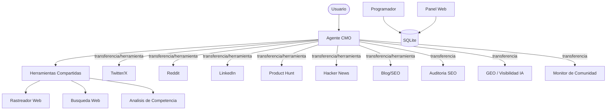

<div align="center">
  
</div>

<h1 align="center">OpenCMO</h1>

<div align="center">
  <strong>El CMO con IA de codigo abierto — las mismas funciones que herramientas de $99/mes, gratis.</strong>
</div>
<br/>

<div align="center">
  <a href="README.md">🇺🇸 English</a> | <a href="README_zh.md">🇨🇳 中文</a> | <a href="README_ja.md">🇯🇵 日本語</a> | <a href="README_ko.md">🇰🇷 한국어</a> | 🇪🇸 Español
</div>

<div align="center">
  <a href="https://www.python.org/downloads/"></a>
  <a href="LICENSE"></a>
  <a href="https://github.com/study8677/OpenCMO/stargazers"></a>
</div>

---

> **Okara cobra $99/mes. Nosotros cobramos $0.** Y cubrimos mas plataformas.

## Que es OpenCMO?

OpenCMO es un sistema multi-agente de IA que actua como tu equipo de marketing completo. Dale una URL — rastrea tu sitio, extrae puntos de venta y genera contenido listo para publicar en **9 canales** a traves de un simple CLI.

Creado para **desarrolladores independientes y equipos pequenos** que prefieren programar antes que escribir copy de marketing.

## Funcionalidades

### 9 Expertos de Plataforma
- **Twitter/X** — Variantes de tweets e hilos con ganchos que detienen el scroll
- **Reddit** — Publicaciones autenticas con historia para r/SideProject y comunidades nicho
- **LinkedIn** — Publicaciones profesionales basadas en datos
- **Product Hunt** — Eslogan, descripcion y comentario de creador
- **Hacker News** — Posts Show HN discretos y tecnicos
- **Blog/SEO** — Esquemas de articulos SEO para Medium y Dev.to

### Inteligencia de Marketing
- **Auditoria SEO** — Core Web Vitals (LCP/CLS/TBT via Google PageSpeed), deteccion de Schema.org/JSON-LD, verificacion de robots.txt/sitemap.xml — cada problema con codigo de correccion copiable
- **Puntuacion GEO** — Visibilidad en 5 plataformas de IA: Perplexity, You.com (rastreo), ChatGPT, Claude, Gemini (API, opcional)
- **Analisis de Competencia** — Inteligencia estructurada: funciones, precios, posicionamiento, diferenciacion
- **Monitor de Comunidad** — Escaneo de Reddit + HN + Dev.to, seguimiento de discusiones, analisis de patrones de interaccion, borradores de respuestas autenticas
- **Busqueda Web** — Investigacion competitiva en tiempo real, tendencias, descubrimiento de palabras clave

### Monitoreo Continuo
- **Programador** — Escaneos automaticos basados en Cron (SEO/GEO/Comunidad) via comandos `/monitor`
- **Analisis de Tendencias** — Historial de puntuaciones SEO y GEO desde almacenamiento persistente SQLite
- **Patrones de Comunidad** — Velocidad de interaccion, distribucion por plataforma, seguimiento de discusiones

### Panel Web
- **FastAPI + Chart.js** — Vision general de proyectos, graficos de tendencias SEO/GEO/Comunidad
- **Sin build frontend** — HTML renderizado en servidor, Chart.js via CDN
- **Un solo comando** — `opencmo-web` o `/web` en CLI

### Orquestacion Inteligente
- **Plataforma unica** → transferencia al experto para creacion de contenido profunda e interactiva
- **Multi-canal** → CMO llama a todos los expertos como herramientas, sintetiza un plan de marketing unificado
- **Modelos configurables** — `OPENCMO_MODEL_DEFAULT=gpt-4o-mini` o configuracion por agente
- **Contexto mantenido** — Historial de conversacion con truncamiento automatico

## Arquitectura



## Inicio Rapido

### 1. Instalar

```bash
pip install -e .
crawl4ai-setup

# Opcional: instalar todas las extensiones
pip install -e ".[all]"   # programador + panel web + GEO premium
```

### 2. Configurar

```bash
cp .env.example .env
# Agregar tu clave API de OpenAI (requerida)
# Opcional: ANTHROPIC_API_KEY, GOOGLE_AI_API_KEY, PAGESPEED_API_KEY
```

### 3. Ejecutar

```bash
opencmo                   # CLI interactivo
opencmo-web               # Panel web (localhost:8080)
```

### Comandos CLI

```
/monitor add <marca> <URL> <categoria>   # Agregar monitoreo continuo
/monitor list                             # Listar todos los monitores
/monitor run <id>                         # Ejecutar escaneo inmediatamente
/status                                   # Ver estado de todos los proyectos
/web                                      # Iniciar panel web
```

## Hoja de Ruta

- [x] 9 expertos de plataforma + orquestacion multi-canal
- [x] Auditoria SEO (CWV + Schema.org + robots/sitemap)
- [x] Puntuacion GEO (5 plataformas de IA)
- [x] Monitoreo de comunidad + analisis de patrones
- [x] Analisis de competencia
- [x] Almacenamiento persistente SQLite
- [x] Modelos configurables por agente
- [x] Programador de monitoreo continuo
- [x] Panel web + graficos de tendencias
- [ ] Auto-publicacion via APIs de plataformas
- [ ] Auditoria SEO de sitio completo (basada en sitemap)
- [ ] Entrenamiento personalizado de voz de marca

## Contribuir

Las contribuciones son bienvenidas! Fork → branch → PR.

## Licencia

Apache License 2.0 — ver [LICENSE](LICENSE).

---

<div align="center">
  Si OpenCMO te resulta util, una <strong>Star</strong> significaria mucho!
</div>
