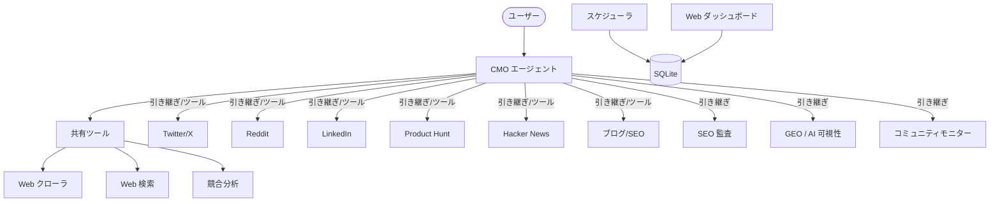

<div align="center">
  
</div>

<h1 align="center">OpenCMO</h1>

<div align="center">
  <strong>オープンソース AI CMO — 月額 $99 のツールと同等の機能を無料で。</strong>
</div>
<br/>

<div align="center">
  <a href="README.md">🇺🇸 English</a> | <a href="README_zh.md">🇨🇳 中文</a> | 🇯🇵 日本語 | <a href="README_ko.md">🇰🇷 한국어</a> | <a href="README_es.md">🇪🇸 Español</a>
</div>

<div align="center">
  <a href="https://www.python.org/downloads/"></a>
  <a href="LICENSE"></a>
  <a href="https://github.com/study8677/OpenCMO/stargazers"></a>
</div>

---

> **Okara は月額 $99、OpenCMO は $0。** しかもカバー範囲はさらに広い。

## OpenCMO とは？

OpenCMO は、マーケティングチーム全体として機能するマルチエージェント AI システムです。URL を入力するだけで、サイトをクロールし、セールスポイントを抽出し、**9 つのチャンネル**向けにすぐ投稿できるコンテンツを生成します。

**インディー開発者や小規模チーム**のために設計 — マーケティングコピーより、コードを書くことに集中できます。

## 機能

### 9 プラットフォーム対応エキスパート
- **Twitter/X** — スクロールを止めるフック付きツイートバリエーション & スレッド
- **Reddit** — r/SideProject やニッチコミュニティ向けの本格的なストーリー投稿
- **LinkedIn** — データ駆動のプロフェッショナルな投稿
- **Product Hunt** — タグライン、説明文、メイカーコメント
- **Hacker News** — 控えめで技術重視の Show HN 投稿
- **ブログ/SEO** — Medium / Dev.to 向け SEO 最適化記事構成

### マーケティングインテリジェンス
- **SEO 監査** — Core Web Vitals（LCP/CLS/TBT、Google PageSpeed 経由）、Schema.org/JSON-LD 検出、robots.txt/sitemap.xml チェック — 各問題にコピペ可能な修正コード付き
- **GEO スコア** — 5 つの AI プラットフォームでの検索可視性: Perplexity、You.com（クロール）、ChatGPT、Claude、Gemini（API、オプトイン）
- **競合分析** — 機能、価格、ポジショニング、差別化ポイントの構造化情報
- **コミュニティモニター** — Reddit + HN + Dev.to をスキャン、ディスカッション追跡、エンゲージメントパターン分析、返信ドラフト作成
- **Web 検索** — リアルタイム競合調査、市場トレンド、キーワード発見

### 継続モニタリング
- **スケジューラ** — `/monitor` CLI コマンドで Cron ベースの自動スキャン（SEO/GEO/コミュニティ）
- **トレンド分析** — SQLite 永続化ストレージに基づく SEO & GEO スコアの履歴推移
- **コミュニティパターン** — エンゲージメント速度、プラットフォーム分布、ディスカッション追跡

### Web ダッシュボード
- **FastAPI + Chart.js** — プロジェクト概要、SEO/GEO/コミュニティのトレンドチャート
- **フロントエンドビルド不要** — サーバーサイドレンダリング HTML、CDN 経由の Chart.js
- **1 コマンドで起動** — `opencmo-web` または CLI で `/web`

### スマートオーケストレーション
- **単一プラットフォーム** → エキスパートに引き渡して深い対話型コンテンツ作成
- **マルチチャンネル** → CMO が全エキスパートをツールとして呼び出し、統合マーケティングプランを作成
- **モデル設定可能** — `OPENCMO_MODEL_DEFAULT=gpt-4o-mini` やエージェント別のオーバーライド
- **コンテキスト維持** — 会話履歴を保持、トークンオーバーフロー防止の自動切り詰め

## アーキテクチャ



## クイックスタート

### 1. インストール

```bash
pip install -e .
crawl4ai-setup

# オプション: 全拡張機能をインストール
pip install -e ".[all]"   # スケジューラ + Web ダッシュボード + GEO プレミアム
```

### 2. 設定

```bash
cp .env.example .env
# OpenAI API キーを追加（必須）
# オプション: ANTHROPIC_API_KEY, GOOGLE_AI_API_KEY, PAGESPEED_API_KEY
```

### 3. 実行

```bash
opencmo                   # 対話型 CLI
opencmo-web               # Web ダッシュボード（localhost:8080）
```

### CLI コマンド

```
/monitor add <ブランド> <URL> <カテゴリ>  # 継続モニタリングを追加
/monitor list                              # 全モニターを一覧
/monitor run <id>                          # 今すぐスキャン実行
/status                                    # 全プロジェクトのスキャン状態を表示
/web                                       # Web ダッシュボードを起動
```

## ロードマップ

- [x] 9 プラットフォーム対応 + マルチチャンネルオーケストレーション
- [x] SEO 監査（CWV + Schema.org + robots/sitemap）
- [x] GEO スコア（5 つの AI プラットフォーム）
- [x] コミュニティモニタリング + パターン分析
- [x] 競合分析
- [x] SQLite 永続化ストレージ
- [x] エージェント別モデル設定
- [x] スケジューラによる継続モニタリング
- [x] Web ダッシュボード + トレンドチャート
- [ ] プラットフォーム API 経由の自動投稿
- [ ] サイトマップベースの全サイト SEO 監査
- [ ] カスタムブランドボイストレーニング

## コントリビューション

コントリビューション大歓迎！Fork → ブランチ作成 → PR。

## ライセンス

Apache License 2.0 — [LICENSE](LICENSE) を参照。

---

<div align="center">
  OpenCMO が役に立ったら <strong>Star</strong> をお願いします！
</div>
