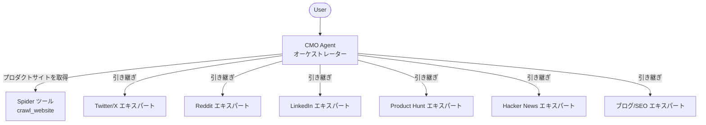

<div align="center">
  
</div>

<h1 align="center">OpenCMO</h1>

<div align="center">
  <strong>あなたのAI最高マーケティング責任者 — マーケティングより開発に集中したいインディー開発者のために。</strong>
</div>
<br/>

<div align="center">
  <a href="README.md">🇺🇸 English</a> | <a href="README_zh.md">🇨🇳 中文</a> | 🇯🇵 日本語 | <a href="README_ko.md">🇰🇷 한국어</a> | <a href="README_es.md">🇪🇸 Español</a>
</div>

<div align="center">
  <a href="https://www.python.org/downloads/"></a>
  <a href="LICENSE"></a>
  <a href="https://github.com/your-username/OpenCMO/stargazers"></a>
</div>

---

## 🌟 OpenCMOとは？

OpenCMOは、**AIマーケティングチーム**として機能するオープンソースのマルチエージェントシステムです。プロダクトのURLを入力するだけで、ウェブサイトをクロールし、主要なセールスポイントを抽出し、各プラットフォームに最適化されたマーケティングコンテンツを生成します — すべてシンプルでエレガントなCLIで完結します。

優れたプロダクトを持っているけれど、すべてのソーシャルチャンネル向けにマーケティング文章を書く時間（や意欲）がない**インディー開発者、個人創業者、小規模チーム**のために特別に設計されています。

## ✨ 機能

- **🐦 Twitter/Xエキスパート** — スクロールを止めるフックを備えたツイートのバリエーションやスレッドを生成します。
- **🤖 Redditエキスパート** — r/SideProjectやニッチなコミュニティ向けに、リアルでストーリー性のある投稿を作成します。
- **💼 LinkedInエキスパート** — 企業っぽくならない、データに基づいたプロフェッショナルな投稿を作成します。
- **🚀 Product Huntエキスパート** — キャッチーなタグライン、説明文、そして最も重要なメイカーのファーストコメント（Maker's comment）を作成します。
- **📰 Hacker Newsエキスパート** — 控えめで技術にフォーカスした "Show HN" 投稿を作成します。
- **📝 ブログ/SEOエキスパート** — MediumやDev.to向けのSEOに強い記事の構成を作成します。

## 🏗️ アーキテクチャ



**CMO Agent**がウェブサイトをクロールし、ワンライナー説明、主要なセールスポイント、ターゲットオーディエンスのプロフィールを抽出します。その後、リクエストに応じて適切なプラットフォームエキスパートにインテリジェントに作業を委任します。

## 🚀 クイックスタート

### 1. インストール

```bash
pip install -e .
crawl4ai-setup
```

### 2. 設定

```bash
cp .env.example .env
# .envを編集してOpenAI APIキーを追加してください
```

### 3. 実行

```bash
opencmo
```

## 💻 セッション例

```text
============================================================
  🎯 OpenCMO - Your AI Chief Marketing Officer
  Type a product URL and what you need, or 'quit' to exit.
============================================================

You: Help me write a tweet for https://crawl4ai.com/

CMO is working... ⚙️

[Twitter/X Expert] 🐦
Here are 3 tweet variants for Crawl4AI:

1. "Tired of writing web scrapers from scratch?
   Crawl4AI gives you LLM-ready markdown from any URL in one line of Python.
   Open source. Blazing fast. #OpenSource #AI"

2. ...

You: Make it more casual and fun

CMO is working... ⚙️

[Twitter/X Expert] 🐦
Sure! Here's a more casual take:
...

You: Now write me a Product Hunt launch post

CMO is working... ⚙️

[Product Hunt Expert] 🚀
...

You: quit
Goodbye! 👋
```

## 🗺️ ロードマップ

- [ ] 🌐 リアルタイムストリーミング対応のWeb UI
- [ ] ⚡ フルチャネルモード：1つのコマンドで6つのプラットフォーム全てのコンテンツを生成
- [ ] 🔗 API連携によるプラットフォームへの自動投稿
- [ ] 📅 コンテンツカレンダーとスケジューリング
- [ ] 🧪 A/Bテストの提案
- [ ] 🎬 その他のプラットフォームエキスパート（YouTube、Instagram、TikTokなど）
- [ ] 🎭 カスタムブランドボイスのトレーニング

## 🤝 コントリビューション

コントリビューションはいつでも大歓迎です！以下の方法でご参加いただけます：

1. リポジトリを**フォーク**する
2. フィーチャーブランチを**作成**する（`git checkout -b feature/amazing-feature`）
3. 変更を**コミット**する（`git commit -m 'Add amazing feature'`）
4. ブランチに**プッシュ**する（`git push origin feature/amazing-feature`）
5. **プルリクエスト**を作成する

**コントリビューションのアイデア：**
- 新しいプラットフォームエキスパートエージェント
- 既存エージェントのプロンプト改善
- Web UIフロントエンド
- テストとドキュメント

## 📄 ライセンス

このプロジェクトはApache License 2.0の下でライセンスされています。詳細は[LICENSE](LICENSE)ファイルをご覧ください。

---

<div align="center">
  OpenCMOが役に立ったら、<strong>スター ⭐</strong> をいただけると私たちの大きな励みになります！
</div>
