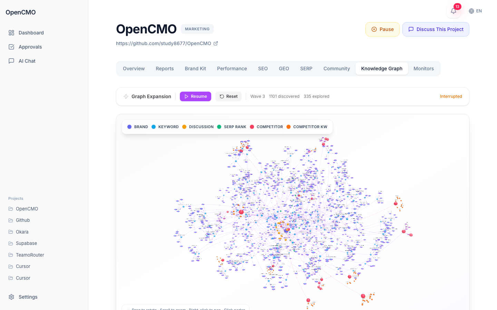

<div align="center">
  
</div>

<h1 align="center">OpenCMO</h1>

<p align="center">
  <strong>URLを貼るだけ → AI CMOの戦略判断、継続監視、Agent Brief をすぐ取得。</strong><br/>
  <sub>Founder と少人数チーム向けのオープンソース AI CMO。SEO、GEO、SERP、コミュニティ、競合文脈、レポート、承認、公開を1つのワークスペースに集約します。</sub>
</p>

<div align="center">
  <a href="README.md">English</a> | <a href="README_zh.md">中文</a> | <a href="README_ja.md">日本語</a> | <a href="README_ko.md">한국어</a> | <a href="README_es.md">Español</a>
</div>

<p align="center">
  <a href="https://www.python.org/downloads/"></a>
  <a href="LICENSE"></a>
  <a href="https://github.com/study8677/OpenCMO/stargazers"></a>
  
</p>

<div align="center">
  <h3>
    <a href="https://www.aidcmo.com/">ライブデモ</a> · <a href="https://www.aidcmo.com/static/demo.mp4">動画を見る</a>
  </h3>
</div>

<div align="center">
  <a href="https://www.aidcmo.com/">
    
  </a>
  <p><i>監視、レポート、承認、競合文脈を1つの画面で確認できます。</i></p>
</div>

---

## 本番環境の実例

OpenCMO は実際のプロジェクトで日々動いています。2 つのライブスキャンから、URL 1 つを入力すると何が生成されるかを示します。

### Coze — グローバル AI エージェントプラットフォームのモニタリング

- **自動検出された競合**: Dify、FastGPT、OpenAI GPTs
- **50 キーワード**を追跡（例: `coze 和 dify 哪个好用`、`coze vs chatgpt custom gpts`）
- 監視期間中に **326 SERP スナップショット**
- **100 件のコミュニティ議論** — Hacker News 61、Bilibili 29、Dev.to 10
- 関連リポジトリから **153 名の GitHub 開発者**を潜在ユーザーとして特定
- 検出: *「Citability スコアが 24 ポイント低下」* — AI 検索の可視性回帰を次回の定期スキャンで自動検知

### DigiGrow — Checkatrade と Wix と競合する英国の SaaS

- **54 キーワード**追跡、**672 SERP ランクチェック**
- **100 件のコミュニティ議論**（Hacker News、Dev.to、Bilibili、V2EX）
- エンドツーエンドで **34 件のアクション可能なインサイト**を生成
- 検出（critical）: `digigrow.uk online marketing solutions` が 24 時間で **#2 から #16 に下落**（5/2 → 5/3）— ダッシュボードを誰もポーリングせずにアクション可能なインサイトとしてプッシュ

> [パブリックデモ](https://www.aidcmo.com/) で自分の URL を試す — 1 スキャン、フルパイプライン、リアルな数値。

---

## OpenCMO が分かりやすい理由

- **URL から始める**: full scan のあとに、まず CMO レベルの市場判断が返ってきます。
- **シグナルを一か所で回す**: SEO、GEO、SERP、コミュニティ変化を同時に監視します。
- **判断を実行に渡す**: レポート、Agent Brief、承認キュー、公開ドラフトまでつながっています。

## 何が手に入るか

- **戦略判断**: ポジショニング、強み、弱み、競争環境、CMO 提案。
- **継続監視**: SEO 健全性、AI 検索可視性、キーワード順位、コミュニティ言及。
- **競合文脈**: 競合、キーワード、コミュニティをつなぐ 3D ナレッジグラフ。
- **実行面**: AI Chat、承認フロー、公開可能なドラフト。

## AI CMO レポート

OpenCMO にはプロジェクトごとの正式なレポート機能があります。**Reports** タブ、または `/projects/<id>/reports` から確認できます。

### マルチエージェント深層レポートパイプライン

人間向けレポートは、単一プロンプトの代わりに **6 段階のマルチエージェントパイプライン**（約 14 回の LLM 呼び出し）で生成されます。

| 段階 | 役割 | 機能 |
| :--- | :--- | :--- |
| 1. Reflection Agent | 品質監査官 | 全 Agent データを交差検証し、異常とギャップを検出 |
| 2. Insight Distiller | アナリスト | 次元横断の分析的洞察を抽出 |
| 3. Outline Planner | 編集長 | 論旨と証拠マッピングで物語構成を設計 |
| 4. Section Writers | 著者（並列） | 各セクションを並列執筆 |
| 5. Section Grader | 査読者 | 各セクションを 1-5 で採点、閾値未満は再執筆 |
| 6. Report Synthesizer | 総編集 | エグゼクティブサマリー、序論、戦略提案を執筆 |

- **Strategic Report**: full scan 後に生成 — 深層競合分析、リスク評価、CMO レベルの戦略提案。
- **Weekly Report**: 直近 7 日の監視ウィンドウ — トレンド分析、リスク/成果、次週アクション計画。
- **二層出力**: **Human Readout**（深層分析）と **Agent Brief**（簡潔なアクション項目）。
- **PDF エクスポート**: ブランドロゴ入りヘッダー/フッター付きの PDF をダウンロード。
- **バージョン履歴**: latest と履歴の両方を参照できます。
- **メール配信**: 週次メールは、画面上と同じ保存済みレポートを再利用します。
- **グレースフル・フォールバック**: パイプライン障害時は自動的にシングルコール → テンプレート生成に降格。

## 「モニタリング開始」を押すと何が起きるか

1つのURLで6段階AIパイプラインが起動し、完全なグロース分析を構築します：

| 段階 | 名前 | 内容 |
|:----:|------|------|
| 1/6 | **Context Build** | URLをクロール。3人のAI専門家（プロダクトアナリスト、SEOストラテジスト、コミュニティストラテジスト）が3ラウンドの議論でブランド名・カテゴリ・キーワード・競合を抽出。 |
| 2/6 | **Signal Collect** | SEO監査、GEO可視性チェック、コミュニティ検索（Reddit、HN、Dev.to等）、SERPキーワード追跡を並行実行。 |
| 3/6 | **Signal Normalize** | 生データをクリーニング・標準化：ディスカッションの重複排除、スコア正規化、キーワード・競合レコードの整合。 |
| 4/6 | **Domain Review** | 4人のAIアナリストがシグナルを独立レビュー：SEO・GEO・コミュニティ・競合アナリスト。 |
| 5/6 | **Strategy Synthesis** | AI戦略ディレクターが全レビューを統合し、優先順位付きの発見事項と実行可能な提案を生成。 |
| 6/6 | **Persist & Publish** | 結果をDBに保存、戦略レポートを生成、ダッシュボードにインサイトを表示。 |

> 初回スキャン後、**毎日・毎週・毎月**の再スキャンをスケジュールして変化を継続追跡できます。

## コア機能

- **SEO Audit**: Core Web Vitals、llms.txt、AI crawler 検出、技術健全性。
- **GEO Visibility**: ChatGPT、Claude、Gemini、Perplexity、You.com などでの見え方を追跡。
- **SERP Tracking**: キーワード順位の推移を監視。
- **Community Monitoring**: Reddit、Hacker News、Dev.to、YouTube、Bluesky、Twitter/X を監視。
- **AI Chat**: 25 以上の専門エージェントとプロジェクト文脈付きで対話。
- **Approval Queue**: 公開前に内容を確認。
- **3D Knowledge Graph**: 競合、キーワード、コミュニティを可視化。

## クイックスタート

OpenAI 互換 API を利用できます。OpenAI、DeepSeek、NVIDIA NIM、Kimi 互換ゲートウェイ、Ollama などに対応します。

```bash
git clone https://github.com/study8677/OpenCMO.git
cd OpenCMO
pip install -e ".[all]"
crawl4ai-setup

cp .env.example .env
opencmo-web
```

その後 `http://localhost:8080` を開きます。

ホームページで URL を入力してスキャンを開始してください。LLM API キーが未設定の場合、Settings アイコンの赤いドットがセットアップパネルへ案内します。

> ヒント: API キーは Web ダッシュボードの **Settings** からも設定できます（`.env` 不要）。

<details>
<summary>フロントエンド開発（任意）</summary>

```bash
cd frontend
npm install
npm run dev
npm run build
```

開発用アプリは `http://localhost:5173` で動作し、API は `:8080` にプロキシされます。

</details>

## 連携

| 機能 | プラットフォーム | 認証 |
| :--- | :--- | :--- |
| 監視 | SEO、GEO、SERP、Community | 任意の provider key |
| コミュニティソース | Reddit、HN、Dev.to、Bluesky、YouTube、Twitter/X | 任意 |
| 公開 | Reddit、Twitter/X | 必須 |
| レポート | Web + Email + PDF | メールは SMTP 必須 |
| LLM | OpenAI 互換 API | 必須 |

## ロードマップ

- [x] AI CMO 戦略スキャン
- [x] SEO / GEO / SERP / コミュニティ監視
- [x] バージョン管理された戦略レポートと週報
- [x] マルチエージェント深層レポートパイプライン（6 段階）
- [x] ブランド付き PDF エクスポート
- [x] 3D ナレッジグラフ
- [x] 承認フローと制御付き公開
- [x] 中国プラットフォームのコミュニティ監視（V2EX、Weibo、Bilibili、XueQiu）
- [x] 完全な i18n 対応（英語、中国語、日本語、韓国語、スペイン語）
- [x] ロケール対応 AI 応答（LLM が UI 言語設定に追従）
- [x] 不安定なプロバイダー向け LLM 指数バックオフリトライ
- [x] オンボーディング簡略化：ホームページで URL を入力するだけで開始可能
- [ ] 公開先の追加
- [ ] ブランドボイス制御
- [ ] より深い企業向け SEO クロール

## Contributors

- [study8677](https://github.com/study8677) - Creator and maintainer
- [Lling0000](https://github.com/Lling0000) - 主要コントリビューター
- [ParakhJaggi](https://github.com/ParakhJaggi) - Tavily integration ([#2](https://github.com/study8677/OpenCMO/pull/2), [#3](https://github.com/study8677/OpenCMO/pull/3))
- [BBear0115](https://github.com/BBear0115) - BYOKキー分離、base_url正規化、レポートのバグ修正 ([#9](https://github.com/study8677/OpenCMO/pull/9))
- 詳細は [CONTRIBUTORS.md](CONTRIBUTORS.md) を参照

## Acknowledgments

- [geo-seo-claude](https://github.com/zubair-trabzada/geo-seo-claude) by [@zubair-trabzada](https://github.com/zubair-trabzada)
- [last30days-skill](https://github.com/mvanhorn/last30days-skill) by [@mvanhorn](https://github.com/mvanhorn)

## Star History

<a href="https://star-history.com/#study8677/OpenCMO&Date">
 <picture>
   <source media="(prefers-color-scheme: dark)" srcset="https://api.star-history.com/svg?repos=study8677/OpenCMO&type=Date&theme=dark" />
   <source media="(prefers-color-scheme: light)" srcset="https://api.star-history.com/svg?repos=study8677/OpenCMO&type=Date" />
   
 </picture>
</a>

## リンク

- [LINUX DO](https://linux.do/) — 技術愛好家が集まるコミュニティ
