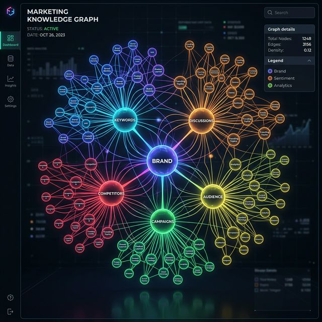

<div align="center">
  
</div>

<h1 align="center">🚀 OpenCMO</h1>

<p align="center">
  <strong>オープンソースAI最高マーケティング責任者(CMO) — 1つのツールがあなたの専属チームに。</strong><br/>
  <sub>10人のエリートAI専門家、リアルタイム監視、そして美しい最新のWebダッシュボードを備えた強力なマルチエージェントシステム。</sub>
</p>

<div align="center">
  <a href="README.md">🇺🇸 English</a> | <a href="README_zh.md">🇨🇳 中文</a> | <a href="README_ja.md">🇯🇵 日本語</a> | <a href="README_ko.md">🇰🇷 한국어</a> | <a href="README_es.md">🇪🇸 Español</a>
</div>

<p align="center">
  <a href="https://www.python.org/downloads/"></a>
  <a href="LICENSE"></a>
  <a href="https://github.com/study8677/OpenCMO/stargazers"></a>
  
</p>

---

## 🌟 OpenCMOとは？

OpenCMOは、インディーハッカーやスモールチーム向けに調整された**マルチエージェントAIマーケティング・エコシステム**です。URLを提供するだけで、OpenCMOが次を行います：
1. 製品とオーディエンスを理解するため**ウェブサイトを深く分析**。
2. 最高のキーワード、ポジショニングを見つけるため**マルチエージェント戦略会議を主催**。
3. SEO、AI検索可視性（GEO）、およびコミュニティ（Reddit、Hacker News、Dev.to）における**継続的監視を自動化**。

---

## ✨ インターフェースと体験

暗いテーマの美しいReact SPAダッシュボードで、最大限の明確さとコントロールを提供します。

<div align="center">
  
  <p><i>リアルタイムダッシュボード — SEOやコミュニティエンゲージメントを一目で追跡。</i></p>
</div>

---

## 🕸️ インタラクティブ・ナレッジグラフ

提供データを動的で美しい**力学モデルによるネットワーク図**（ナレッジグラフ）へと変換します。

<div align="center">
  
</div>

### ゲームチェンジャーである理由：
- 🔵 **インタラクティブ探索**: ズームとドラッグでマーケティング宇宙を探索。
- 🟢 **6つのノード次元**: ブランド（紫）、キーワード（シアン）、コミュニティの議論（琥珀）、検索順位（緑）、競合（赤）、重複するキーワード（オレンジ）を可視化。
- ⚡ **リアルタイム同期**: 新しい洞察が抽出されると30秒ごとに自動更新。

---

## 👥 あなたのAIマーケティングチーム

| 役割 | 専門性 | 責任 |
| :--- | :--- | :--- |
| **👔 CMOエージェント** | 全体統括 | 最適な専門家へのタスクの割り当て。 |
| **🐦 Twitter/X 専門家** | マイクロブログ | 魅力的なツイートとスレッドの作成。 |
| **👽 Reddit 戦略家**| コミュニティ | ライブなサブレディット向けの自然な投稿と返信。 |
| **💼 LinkedIn プロ** | B2B | 専門的な思考のリーダーシップ投稿。 |
| **💻 Hacker News** | ギーク | 技術的な "Show HN" 投稿の作成。 |
| **📝 Blog/SEO**| 長文コンテンツ | 2000語以上のSEO最適化記事の執筆。 |
| **🔍 SEO監査役** | テクニカルSEO | Core Web Vitalsやサイトマップの監査。 |
| **🤖 GEO専門家** | 生成AI | ChatGPTやClaudeにおけるブランド言及の監視。 |

---

## ⚙️ クイックスタートガイド

```bash
git clone https://github.com/study8677/OpenCMO.git
cd OpenCMO

# 依存関係のインストール
pip install -e ".[all]"

# .envの設定
cp .env.example .env

# WEBダッシュボードの起動
opencmo-web
```
🚀 ブラウザで [http://localhost:8080/app](http://localhost:8080/app) を開いてください。

---

<p align="center">
  Made with ❤️ by the Open Source Community. <br/>
  <b>役に立ったら、GitHubで⭐をお願いします！</b>
</p>
