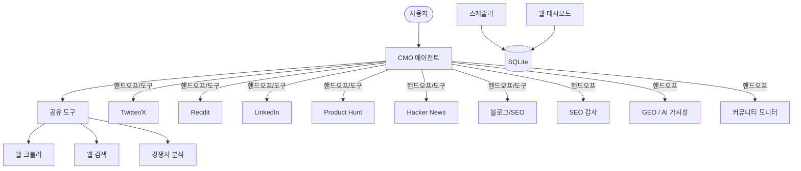

<div align="center">
  
</div>

<h1 align="center">OpenCMO</h1>

<div align="center">
  <strong>오픈소스 AI CMO — 월 $99짜리 도구의 기능을 무료로.</strong>
</div>
<br/>

<div align="center">
  <a href="README.md">🇺🇸 English</a> | <a href="README_zh.md">🇨🇳 中文</a> | <a href="README_ja.md">🇯🇵 日本語</a> | 🇰🇷 한국어 | <a href="README_es.md">🇪🇸 Español</a>
</div>

<div align="center">
  <a href="https://www.python.org/downloads/"></a>
  <a href="LICENSE"></a>
  <a href="https://github.com/study8677/OpenCMO/stargazers"></a>
</div>

---

> **Okara는 월 $99, OpenCMO는 $0.** 더 많은 플랫폼도 지원합니다.

## OpenCMO란?

OpenCMO는 마케팅 팀 역할을 하는 멀티 에이전트 AI 시스템입니다. URL을 입력하면 사이트를 크롤링하고, 핵심 셀링 포인트를 추출하며, **9개 채널**에 바로 게시할 수 있는 콘텐츠를 생성합니다.

**인디 개발자와 소규모 팀**을 위해 만들어졌습니다 — 마케팅 카피보다 코드에 집중하세요.

## 주요 기능

### 9개 플랫폼 전문가
- **Twitter/X** — 스크롤 멈추는 훅이 있는 트윗 변형 & 스레드
- **Reddit** — r/SideProject 및 니치 커뮤니티에 적합한 진정성 있는 스토리 게시글
- **LinkedIn** — 데이터 기반의 전문적인 게시글
- **Product Hunt** — 태그라인, 설명, 메이커 코멘트
- **Hacker News** — 절제되고 기술 중심적인 Show HN 게시글
- **블로그/SEO** — Medium / Dev.to용 SEO 친화적 아티클 구성

### 마케팅 인텔리전스
- **SEO 감사** — Core Web Vitals (LCP/CLS/TBT, Google PageSpeed 사용), Schema.org/JSON-LD 감지, robots.txt/sitemap.xml 검사 — 각 문제에 복사 가능한 수정 코드 포함
- **GEO 점수** — 5개 AI 플랫폼의 검색 가시성: Perplexity, You.com (크롤링), ChatGPT, Claude, Gemini (API, 옵트인)
- **경쟁사 분석** — 기능, 가격, 포지셔닝, 차별화 포인트의 구조화된 정보
- **커뮤니티 모니터** — Reddit + HN + Dev.to 스캔, 토론 추적, 참여 패턴 분석, 진정성 있는 답글 초안 생성
- **웹 검색** — 실시간 경쟁 조사, 시장 트렌드, 키워드 발견

### 지속적 모니터링
- **스케줄러** — `/monitor` CLI 명령어로 Cron 기반 자동 스캔 (SEO/GEO/커뮤니티)
- **트렌드 분석** — SQLite 영구 저장소 기반 SEO & GEO 점수 추이
- **커뮤니티 패턴** — 참여도 증가 속도, 플랫폼 분포, 토론 추적

### 웹 대시보드
- **FastAPI + Chart.js** — 프로젝트 개요, SEO/GEO/커뮤니티 트렌드 차트
- **프론트엔드 빌드 불필요** — 서버 사이드 렌더링 HTML, CDN Chart.js
- **한 줄로 시작** — `opencmo-web` 또는 CLI에서 `/web`

### 스마트 오케스트레이션
- **단일 플랫폼** → 전문가에게 핸드오프하여 심층 대화형 콘텐츠 작성
- **멀티 채널** → CMO가 모든 전문가를 도구로 호출, 통합 마케팅 플랜 생성
- **모델 설정 가능** — `OPENCMO_MODEL_DEFAULT=gpt-4o-mini` 또는 에이전트별 오버라이드
- **컨텍스트 유지** — 대화 기록 유지, 토큰 오버플로 방지 자동 트렁케이션

## 아키텍처



## 빠른 시작

### 1. 설치

```bash
pip install -e .
crawl4ai-setup

# 선택: 모든 확장 기능 설치
pip install -e ".[all]"   # 스케줄러 + 웹 대시보드 + GEO 프리미엄
```

### 2. 설정

```bash
cp .env.example .env
# OpenAI API 키 추가 (필수)
# 선택: ANTHROPIC_API_KEY, GOOGLE_AI_API_KEY, PAGESPEED_API_KEY
```

### 3. 실행

```bash
opencmo                   # 대화형 CLI
opencmo-web               # 웹 대시보드 (localhost:8080)
```

### CLI 명령어

```
/monitor add <브랜드> <URL> <카테고리>   # 지속적 모니터링 추가
/monitor list                             # 모든 모니터 목록
/monitor run <id>                         # 즉시 스캔 실행
/status                                   # 모든 프로젝트 스캔 상태 보기
/web                                      # 웹 대시보드 시작
```

## 로드맵

- [x] 9개 플랫폼 전문가 + 멀티채널 오케스트레이션
- [x] SEO 감사 (CWV + Schema.org + robots/sitemap)
- [x] GEO 점수 (5개 AI 플랫폼)
- [x] 커뮤니티 모니터링 + 패턴 분석
- [x] 경쟁사 분석
- [x] SQLite 영구 저장소
- [x] 에이전트별 모델 설정
- [x] 스케줄러 기반 지속적 모니터링
- [x] 웹 대시보드 + 트렌드 차트
- [ ] 플랫폼 API를 통한 자동 게시
- [ ] 사이트맵 기반 전체 사이트 SEO 감사
- [ ] 맞춤형 브랜드 보이스 학습

## 기여하기

기여는 언제나 환영합니다! Fork → 브랜치 생성 → PR.

## 라이선스

Apache License 2.0 — [LICENSE](LICENSE) 참조.

---

<div align="center">
  OpenCMO가 도움이 되셨다면 <strong>Star</strong>를 눌러주세요!
</div>
