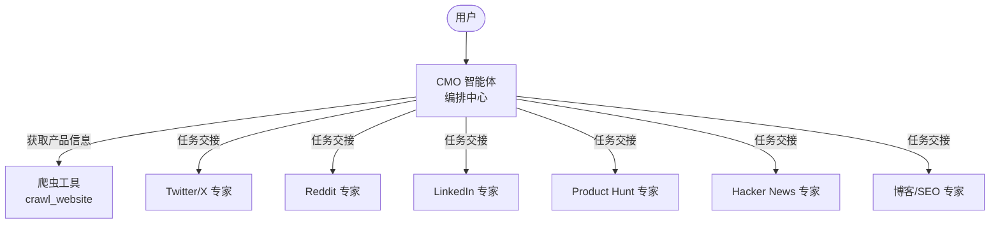

<div align="center">
  
</div>

<h1 align="center">OpenCMO</h1>

<div align="center">
  <strong>你的 AI 首席营销官 —— 专为不想操心营销的独立开发者打造。</strong>
</div>
<br/>

<div align="center">
  <a href="README.md">🇺🇸 English</a> | 🇨🇳 中文 | <a href="README_ja.md">🇯🇵 日本語</a> | <a href="README_ko.md">🇰🇷 한국어</a> | <a href="README_es.md">🇪🇸 Español</a>
</div>

<div align="center">
  <a href="https://www.python.org/downloads/"></a>
  <a href="LICENSE"></a>
  <a href="https://github.com/your-username/OpenCMO/stargazers"></a>
</div>

---

## 🌟 什么是 OpenCMO？

OpenCMO 是一个开源的多智能体系统，充当你的**全能 AI 营销团队**。只需提供你的产品 URL，它就会自动爬取你的网站、提炼核心卖点，并生成各平台专属的营销内容 —— 一切通过极其简洁的命令行界面完成。

专为**独立开发者、个人创业者和小团队**打造 —— 你有一款出色的产品，但没时间（或没兴趣）为每个社交平台苦思冥想营销文案。

## ✨ 功能特性

- **🐦 Twitter/X 专家** —— 生成多种推文变体和话题线程，用精彩的开头吸引用户停下滑动看你的产品。
- **🤖 Reddit 专家** —— 撰写真实、有故事感的帖子，完美契合 r/SideProject 及各类垂直极客社区。
- **💼 LinkedIn 专家** —— 撰写专业、数据驱动的帖子，远离无聊枯燥的企业腔。
- **🚀 Product Hunt 专家** —— 创作吸睛的标语、产品描述和至关重要的创作者首评（Maker's comment）。
- **📰 Hacker News 专家** —— 撰写低调务实、技术聚焦的 Show HN 帖子。
- **📝 博客/SEO 专家** —— 为 Medium 和 Dev.to 精心规划 SEO 友好的文章大纲。

## 🏗️ 架构



**CMO 智能体**会爬取你的网站，提取一句话简介、核心卖点和目标用户画像，然后根据你的明确需求，智能地将任务派发给最合适的平台专家。

## 🚀 快速开始

### 1. 安装环境

```bash
pip install -e .
crawl4ai-setup
```

### 2. 配置密钥

```bash
cp .env.example .env
# 编辑 .env 文件，填入你的 OpenAI API 密钥
```

### 3. 运行项目

```bash
opencmo
```

## 💻 示例会话

```text
============================================================
  🎯 OpenCMO - 你的 AI 首席营销官
  输入产品 URL 和你的需求，或输入 'quit' 退出。
============================================================

You: 帮我为 https://crawl4ai.com/ 写一条推文

CMO 正在思考... ⚙️

[Twitter/X 专家] 🐦
以下是为 Crawl4AI 生成的 3 条推文变体：

1. "还在从零开始写网页爬虫？
   Crawl4AI 只需一行 Python 代码就能从任意 URL 获取 LLM 可用的 Markdown。
   开源。极速。#OpenSource #AI"

2. ...

You: 让文案更随性、更有趣一些

CMO 正在思考... ⚙️

[Twitter/X 专家] 🐦
没问题！这是更轻松的版本：
...

You: 现在帮我写一篇 Product Hunt 发布帖

CMO 正在思考... ⚙️

[Product Hunt 专家] 🚀
...

You: quit
再见！👋
```

## 🗺️ 路线图

- [ ] 🌐 带实时流式输出的 Web UI 界面
- [ ] ⚡ 全渠道模式：一条命令一键为所有 6 个平台生成内容
- [ ] 🔗 通过 API 集成自动发布到各平台
- [ ] 📅 内容日历与定时发布功能
- [ ] 🧪 A/B 测试建议与数据反馈
- [ ] 🎬 更多平台专家（YouTube、Instagram、TikTok 等）
- [ ] 🎭 自定义品牌语调训练

## 🤝 参与贡献

我们非常欢迎你的加入！以下是参与步骤：

1. **Fork** 本仓库
2. **创建**功能分支（`git checkout -b feature/amazing-feature`）
3. **提交**你的更改（`git commit -m 'Add amazing feature'`）
4. **推送**到分支（`git push origin feature/amazing-feature`）
5. **发起** Pull Request

**贡献方向参考：**
- 编写新的平台专家智能体
- 优化或微调现有智能体的提示词
- 开发 Web UI 前端
- 增加测试用例与完善文档

## 📄 许可证

本项目基于 Apache License 2.0 许可证开源 —— 详情请参阅 [LICENSE](LICENSE) 文件。

---

<div align="center">
  如果 OpenCMO 对你有帮助，请顺手给个 <strong>Star ⭐</strong>，这是对我们最大的鼓励！
</div>
