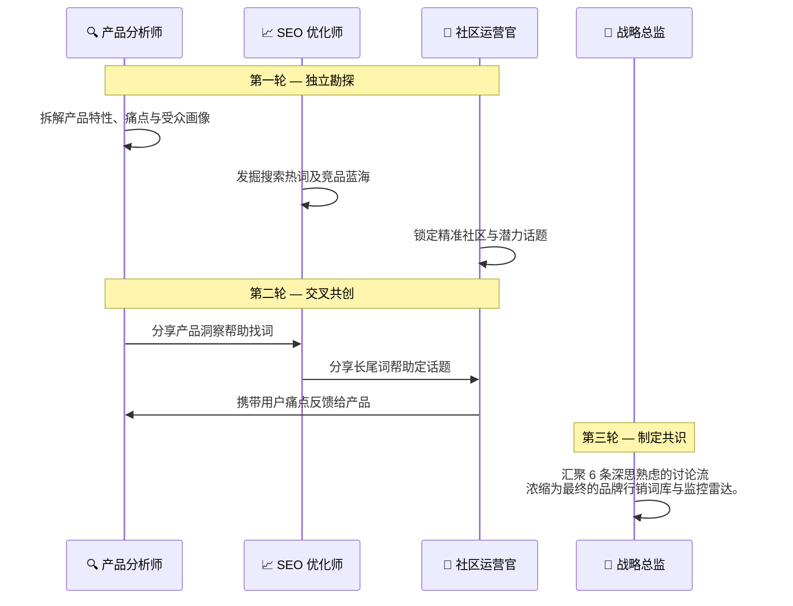

<div align="center">
  
</div>

<h1 align="center">🚀 OpenCMO</h1>

<p align="center">
  <strong>开源 AI 首席营销官 (CMO) —— 一个工具，你的整个营销团队。</strong><br/>
  <sub>强大的多智能体系统，内置 10 位精英 AI 专家，提供实时策略监控和现代化的数据仪表盘。</sub>
</p>

<div align="center">
  <a href="README.md">🇺🇸 English</a> | <a href="README_zh.md">🇨🇳 中文</a> | <a href="README_ja.md">🇯🇵 日本語</a> | <a href="README_ko.md">🇰🇷 한국어</a> | <a href="README_es.md">🇪🇸 Español</a>
</div>

<p align="center">
  <a href="https://www.python.org/downloads/"></a>
  <a href="LICENSE"></a>
  <a href="https://github.com/study8677/OpenCMO/stargazers"></a>
  
</p>

---

## 🌟 OpenCMO 是什么？

OpenCMO 是一个专为独立开发者、初创公司和小团队设计的 **多智能体 AI 营销生态系统**。只需输入您的产品链接，OpenCMO 将会：
1. **深度解析您的网站**，理解您的产品定位和目标受众。
2. **策动多智能体策略辩论**，精准提炼最佳关键词、定位以及目标社区。
3. **自动化持续监控** 覆盖 SEO、AI 搜索可见度 (GEO)、以及发烧友社区 (Reddit, Hacker News, Dev.to) 的全网动态。

---

## ✨ 界面与交互体验

我们为您精心打造了一个以暗黑风、毛玻璃质感为主的 React 单页面应用 (SPA)，让您以最直观的方式掌控全局。

<div align="center">
  
  <p><i>实时项目仪表盘 — 一目了然地追踪您的 SEO、 GEO (AI 可见度) 以及社区互动情况。</i></p>
</div>

---

## 🕸️ 交互式知识图谱

**知识图谱**是您市场情报的核心。我们将抽象的数据转化为令人惊艳的交互式力导向关系网络。

<div align="center">
  
  <p><i>品牌营销战略生态的 3D 力导向可视化动态地图</i></p>
</div>

### 为什么它具有颠覆性：
- 🔵 **交互式探索**：自由缩放、拖拽和漫游您的数字品牌宇宙。
- 🟢 **6 大维度节点**：直观区分 品牌 (紫色)、关键词 (青色)、社区讨论 (琥珀色)、搜索引擎排名 (绿色)、竞品 (红色) 以及重叠冲突关键词 (橙色)。
- 🔴 **竞品情报网络**：添加竞品 URL，立刻在图谱中高亮显示竞争交锋地带（以红色虚线动态连接）。
- ⚡ **毫秒级实时同步**：随着新数据的抓取，图谱每 30 秒自动重力平衡和刷新。

---

## 👥 你的专属 AI 营销团队

OpenCMO 内部搭载了 **10 位各司其职的 AI 专家**，紧密协作：

| 专家角色 | 专长领域 | 核心职责 |
| :--- | :--- | :--- |
| **👔 CMO 首席营销官** | 统筹规划 | 整个团队的大脑。接收请求并自动路由分配给最合适的专家。 |
| **🐦 Twitter/X 专家** | 微博客流转 | 撰写引人入胜的推文、鉤子 (Hook) 及可能疯传的帖子串。 |
| **👽 Reddit 战略家**| 社区运营 | 撰写极具原生态、反刻板推销的帖子，智能回复活跃板块。 |
| **💼 LinkedIn 职场专家** | B2B 社交 | 塑造高度专业的行业领导力深度文章。 |
| **🚀 Product Hunt 专家** | 产品发布 | 准备极具冲击力的 Slogan、描述文案以及 Maker 评论。 |
| **💻 Hacker News 极客** | 技术极客圈 | 编排极硬核的 "Show HN" 技术贴，妥善处理犀利反馈。 |
| **📝 Blog/SEO 写手**| 长文创作 | 产出结构完整、符合 SEO 最佳实践的长篇博文 (2000词+)。 |
| **🔍 SEO 审计师** | 技术 SEO | 审查核心网页指标、Schema.org 结构、robots 及网站地图。 |
| **🤖 GEO 能见度专家**| AI 引擎优化 | 监控品牌在 Perplexity, ChatGPT, Claude, Gemini 等 AI 中的被提及率。 |
| **👀 社区雷达** | 社交聆听 | 实时扫掠 Reddit, HN, Dev.to 取回高价值的潜在讨论并报警。 |

---

## 🧩 核心机制：多智能体联合辩论

当您提交一个 URL，OpenCMO 绝不是简单地调用一次大模型 API。它会让不同的角色专家进行一场真正的 **3 轮交叉协作讨论**：



通过让 AI 互相读取、启发和纠偏，OpenCMO 能产出比单次对话丰富、立体得多的战略方案。

---

## ⚙️ 极速启动指南

OpenCMO 兼容所有的 OpenAI 协议 API，您享有绝对的底层控制权（支持 **OpenAI, DeepSeek, 阿里云, Kimi, Ollama** 等）。

### 1. 本地安装

```bash
git clone https://github.com/study8677/OpenCMO.git
cd OpenCMO

# 安装全部依赖包
pip install -e ".[all]"

# 初始化爬虫引擎配置
crawl4ai-setup
```

### 2. 参数配置

```bash
cp .env.example .env
```
编辑 `.env` 填入您的模型密钥。*以 DeepSeek 为例：*
```env
OPENAI_API_KEY=sk-您的APIKey
OPENAI_BASE_URL=https://api.deepseek.com/v1
OPENCMO_MODEL_DEFAULT=deepseek-chat
```

### 3. 点火起飞 🚀

```bash
opencmo-web
```
🚀 **您的数字 CMO 团队已就位！** 浏览器打开 [http://localhost:8080/app](http://localhost:8080/app)。

> *如果您热爱纯命令行，运行直接运行 `opencmo` 即可开启终端沉浸式交互模式。*

---

## 📸 极美界面漫游

<details>
<summary><b>点击展开查看我们的 UI 画廊</b></summary>
<br>

**1. 多智能体辩论现场**  


**2. 专家级对话终端**  


**3. 监控矩阵与分析大盘**  


**4. 秘钥安全存储库**  


</details>

---

<p align="center">
  由开源社区倾情打造 ❤️ <br/>
  <b>如果 OpenCMO 帮您节省了时间，请在 GitHub 给我们一颗宝贵的 ⭐！</b>
</p>
