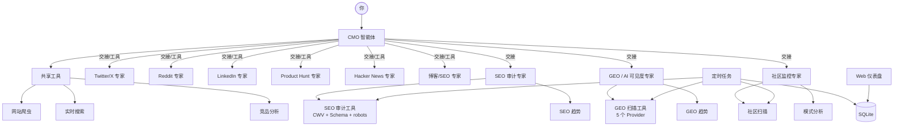

<div align="center">
  
</div>

<h1 align="center">OpenCMO</h1>

<div align="center">
  <strong>开源 AI CMO —— 别人收 $99/月的能力，我们免费给你。</strong>
</div>
<br/>

<div align="center">
  <a href="README.md">🇺🇸 English</a> | 🇨🇳 中文 | <a href="README_ja.md">🇯🇵 日本語</a> | <a href="README_ko.md">🇰🇷 한국어</a> | <a href="README_es.md">🇪🇸 Español</a>
</div>

<div align="center">
  <a href="https://www.python.org/downloads/"></a>
  <a href="LICENSE"></a>
  <a href="https://github.com/study8677/OpenCMO/stargazers"></a>
</div>

---

> **Okara 收费 $99/月，我们收费 $0。** 而且覆盖更多平台。

## 什么是 OpenCMO？

OpenCMO 是一个多智能体 AI 系统，充当你的完整营销团队。给它一个 URL，它就会爬取网站、提炼卖点，为 **9 个渠道** 生成即发即用的营销内容 —— 通过一个简洁的命令行界面。

专为**独立开发者和小团队**打造 —— 你只管写代码，营销的事交给它。

## 为什么选 OpenCMO？

| 能力 | Okara ($99/月) | OpenCMO (免费) |
|---|:---:|:---:|
| Twitter/X 内容生成 | 有 | 有 |
| Reddit 帖子 | 仅生成 | 生成 + 监控 |
| LinkedIn 帖子 | 计划中 | 有 |
| Product Hunt 发布文案 | 无 | 有 |
| Hacker News 帖子 | 仅监控 | 生成 + 监控 |
| 博客/SEO 文章 | 无 | 有 |
| 实时搜索（趋势/竞品） | 有 | 有 |
| SEO 审计（CWV + Schema.org + robots/sitemap） | 基础 | 有 |
| GEO 评分（5 个 AI 平台） | 有 | 有 |
| 社区监控 + 模式分析 | 有 | 有 |
| 竞品分析 | 有 | 有 |
| 持续监控（定时任务） | 有 | 有 |
| Web 仪表盘 + 趋势图表 | 有 | 有 |
| 按 Agent 配置模型 | 无 | 有 |
| 一键全渠道生成 | 无 | 有 |
| 开源 | 否 | 是 |
| **覆盖平台数** | **3** | **9** |

## 功能特性

### 9 大平台专家
- **Twitter/X** —— 多种推文变体 + 话题线程，精心设计开头钩子
- **Reddit** —— 真实、有故事感的帖子，适配 r/SideProject 等社区
- **LinkedIn** —— 专业但不无聊的数据驱动型帖子
- **Product Hunt** —— 标语、描述、创作者首评一站搞定
- **Hacker News** —— 低调务实的技术向 Show HN 帖子
- **博客/SEO** —— 为 Medium / Dev.to 生成 SEO 友好的文章大纲

### 营销情报
- **SEO 审计** —— Core Web Vitals（LCP/CLS/TBT，通过 Google PageSpeed）、Schema.org/JSON-LD 检测、robots.txt/sitemap.xml 检查、页面元素分析 —— 每个问题附带可直接复制的修复代码
- **GEO 评分** —— AI 搜索可见度分析，覆盖 5 个平台：Perplexity、You.com（爬取）、ChatGPT、Claude、Gemini（API，需启用）
- **竞品分析** —— 结构化情报：功能、定价、定位、差异化机会
- **社区监控** —— 扫描 Reddit + HN + Dev.to，追踪讨论变化，分析参与度趋势，生成真诚的回复建议
- **实时搜索** —— 竞品研究、市场趋势、关键词发现

### 持续监控
- **定时任务** —— 通过 `/monitor` CLI 命令设置 Cron 定时扫描（SEO/GEO/社区）
- **趋势分析** —— 基于 SQLite 持久化存储的 SEO & GEO 历史评分趋势
- **社区模式** —— 参与度增长速度、平台分布、讨论追踪

### Web 仪表盘
- **FastAPI + Chart.js** —— 项目概览、SEO/GEO/社区趋势图表
- **无需前端构建** —— 服务端渲染 HTML，Chart.js 通过 CDN 加载
- **一条命令启动** —— `opencmo-web` 或在 CLI 中输入 `/web`

### 智能编排
- **单平台** → 交接给专家，深度互动式创作
- **全渠道** → CMO 以工具模式调用所有专家，汇总输出完整营销方案
- **灵活模型** —— 设置 `OPENCMO_MODEL_DEFAULT=gpt-4o-mini` 或按 Agent 分别覆盖
- **上下文感知** —— 保持对话历史，自动截断防止 token 溢出

## 架构



## 快速开始

### 1. 安装

```bash
pip install -e .
crawl4ai-setup

# 可选：安装全部扩展依赖
pip install -e ".[all]"   # 定时任务 + Web 仪表盘 + GEO 高级平台
```

### 2. 配置

```bash
cp .env.example .env
# 填入 OpenAI API Key（必须）
# 可选：ANTHROPIC_API_KEY, GOOGLE_AI_API_KEY, PAGESPEED_API_KEY
```

### 3. 运行

```bash
opencmo                   # 交互式 CLI
opencmo-web               # Web 仪表盘（localhost:8080）
```

### CLI 命令

```
/monitor add <品牌> <URL> <类别>        # 添加持续监控
/monitor list                            # 查看所有监控任务
/monitor run <id>                        # 立即执行一次扫描
/status                                  # 查看所有项目扫描状态
/web                                     # 启动 Web 仪表盘
```

## 使用示例

```text
You: 帮我为 https://crawl4ai.com/ 做一个全平台推广方案

[CMO Agent]
以下是 Crawl4AI 的全渠道营销方案：
## Twitter/X  ## Reddit  ## LinkedIn  ## Product Hunt  ## Hacker News  ## 博客
...
```

```text
You: 审计一下 https://myproduct.com 的 SEO

[SEO 审计专家]
# SEO 审计报告
[OK] 性能评分: 87/100
[WARNING] LCP: 2800ms (Good <2500ms)
[OK] Schema.org: 发现类型: Organization, WebSite
[CRITICAL] sitemap.xml: 未找到
...
```

```text
You: 查一下 Crawl4AI 在 AI 搜索引擎里的 GEO 评分

[AI 可见度专家]
# GEO 评分: 62/100
## 平台结果（2 个启用，3 个未启用）
### Perplexity [启用]: 已发现 — 3 次提及
### You.com [启用]: 已发现 — 1 次提及
## 未启用平台
- ChatGPT: 设置 OPENCMO_GEO_CHATGPT=1 启用
...
```

```text
You: /monitor add Crawl4AI https://crawl4ai.com "web scraping"

监控 #1 已创建: Crawl4AI (https://crawl4ai.com) — full 扫描, cron: 0 9 * * *
```

## 路线图

- [x] 9 大平台专家 + 全渠道编排
- [x] SEO 审计（CWV + Schema.org + robots/sitemap）
- [x] GEO 评分（5 个 AI 平台）
- [x] 社区监控 + 模式分析
- [x] 竞品分析
- [x] SQLite 持久化存储
- [x] 按 Agent 配置模型
- [x] 定时任务持续监控
- [x] Web 仪表盘 + 趋势图表
- [ ] 通过平台 API 自动发布
- [ ] 全站 SEO 审计（基于 Sitemap）
- [ ] 自定义品牌语调训练

## 参与贡献

欢迎贡献！Fork → 开分支 → 提 PR。

**贡献方向：**
- 新平台专家（YouTube、Instagram、TikTok）
- 优化现有专家的提示词
- Web 仪表盘增强
- 自动发布集成

## 许可证

Apache License 2.0 —— 详见 [LICENSE](LICENSE)。

---

<div align="center">
  如果 OpenCMO 对你有帮助，顺手给个 <strong>Star</strong> 就是最大的支持！
</div>
